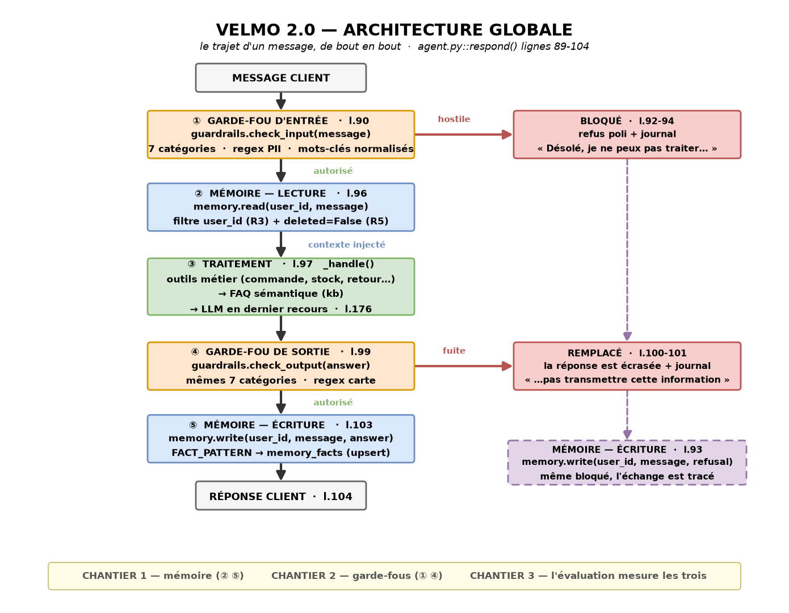
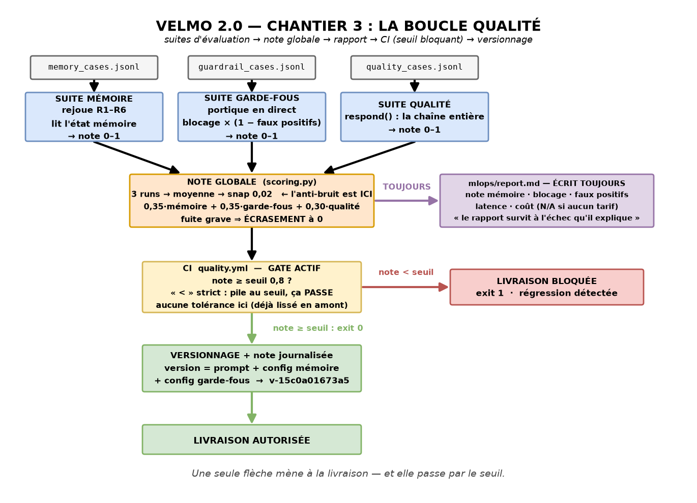

# Dossier de conception — Velmo 2.0

**Auteur :** Era · **Dernière vérification contre le code :** 2026-07-17

> Le brief exige quatre artefacts de conception, validés par le formateur avant tout code.
> Les voici, avec l'état d'avancement de chacun.

---

## Les quatre artefacts

| # | Artefact | Fichier | Vérifié contre le code |
|---|---|---|---|
| **1** | **Schéma d'architecture global** | [`schema-01-architecture-globale.png`](schema-01-architecture-globale.png) | ✅ 8/8 références de ligne exactes |
| **2** | **Modèle de données de la mémoire** | [`03-modele-donnees-memoire.md`](03-modele-donnees-memoire.md) | ✅ 6/6 contrôles (isolation, soft-delete, 3 couches) |
| **3** | **Tableau des garde-fous** | [`02-tableau-garde-fous.md`](02-tableau-garde-fous.md) | ✅ 7 catégories, 3 messages de refus, 3 failles fermées |
| **4** | **Schéma de la boucle qualité** | [`schema-04-boucle-qualite.png`](schema-04-boucle-qualite.png) | ✅ corrigé le 17/07 (3 erreurs trouvées) |

**En complément** — [`schema-05-implementation.png`](schema-05-implementation.png) : la vue
implémentation du Chantier 3 (fichiers réels, fonctions, ordre des tâches). Pas exigée par le
brief, utile pour la revue de code.

---

## 1 · Le schéma d'architecture global



**Le trajet exigé par le brief**, et l'ordre réel du code — ils coïncident :

```
entrée → garde-fou d'entrée → mémoire (lecture) → LLM → garde-fou de sortie → mémoire (écriture) → réponse
  l.89        l.90                 l.96          l.97        l.99                 l.103           l.104
```

**Trois points que le schéma rend visibles :**

**Le chemin bloqué écrit aussi en mémoire** (l.93). Un refus n'est pas un trou dans l'historique :
si un client se voit refuser trois messages d'affilée, l'agent doit pouvoir le savoir.

**La mémoire est lue *après* le garde-fou d'entrée.** Un message hostile ne doit pas déclencher
de lecture — on ne dépense rien pour ce qu'on va refuser.

**Le LLM est le dernier recours, pas le premier réflexe.** `_handle()` essaie d'abord les outils
métier, puis la FAQ. Sur les 8 questions métier de l'évaluation, **le modèle n'est jamais
appelé** — les réponses viennent de la base et du KB.

---

## 2 · Le modèle de données de la mémoire

→ **[`03-modele-donnees-memoire.md`](03-modele-donnees-memoire.md)**

Trois couches déclarées (`history` · `facts` · `episodic`), **une seule persistée** : la table
`memory_facts`. `user_id` indexé porte l'isolation (**R3**), `deleted` porte le droit à l'oubli
(**R5**) en effacement **logique** — on garde la trace que l'effacement a eu lieu.

**Limite assumée et mesurée** : note mémoire **0,500** (6/12). `FACT_PATTERN` ne reconnaît
qu'une tournure. Ce n'est pas un bug de l'évaluation — c'est **la mesure honnête** de ce que
l'extraction fait aujourd'hui.

---

## 3 · Le tableau des garde-fous

→ **[`02-tableau-garde-fous.md`](02-tableau-garde-fous.md)**

**7 catégories × 2 emplacements**, avec pour chacune la méthode de détection et l'action.
Trois méthodes, chacune pour une raison : **regex** (la PII a une forme), **normalisation**
(les accents créaient un trou), **ancrage au début de mot** (« bourse » bloquait
« rem**bourse**ment »).

**Note garde-fous : 1,000** — 23/23 attaques bloquées, 0/12 faux positifs. Elle était à 0,917
avant que trois failles soient trouvées **hors des tests**.

---

## 4 · Le schéma de la boucle qualité



```
3 suites → note globale → rapport (toujours) → CI (seuil bloquant) → versionnage
```

**Les 4 décisions de conception** — voir [`../chantier3/DOSSIER-CONCEPTION.md`](../chantier3/DOSSIER-CONCEPTION.md)
pour la justification complète :

| Décision | Valeur |
|---|---|
| Seuil de blocage | **0,80** — pile au seuil, ça passe (`<` strict) |
| Pondération | **0,35 mémoire · 0,35 garde-fous · 0,30 qualité** + **fuite grave ⇒ 0** |
| Anti-bruit | moyenne sur **3 runs**, arrondie au pas de **0,02** |
| Version | prompt + config mémoire + config garde-fous → SHA-256 |

---

## L'état mesuré aujourd'hui

```
mémoire 0,500  ·  garde-fous 1,000  ·  qualité 1,000   →   globale 0,825   (seuil 0,80 : PASSE)
version v-15c0a01673a5   ·   19 passed, 0 failed   ·   gate CI actif
```

Agent dégradé (garde-fous retirés) → `serious_leak` → **globale 0,0** → livraison bloquée.

---

## Ce que ces documents ne prétendent pas

**La détection des garde-fous est lexicale, pas sémantique.** Une injection reformulée passe.

**La couche épisodique (Chroma) est déclarée, pas construite.** `render()` la sérialise déjà.

**Le versionnage hashe la config, pas la logique.** Corriger un bug dans le code des garde-fous
change le comportement **sans** faire bouger l'empreinte. Limite identifiée, pas masquée.

---

## Validation formateur

- [ ] Schéma d'architecture global
- [ ] Modèle de données de la mémoire
- [ ] Tableau des garde-fous
- [ ] Schéma de la boucle qualité + les 4 décisions

**Décision :** _______________________  **Date :** __________
