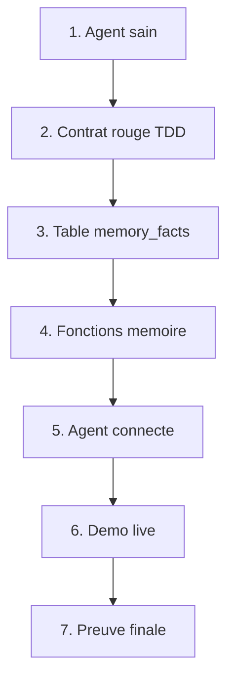

# Velmo V2 - Chantier 1 Memoire - Debrief complet

> Source: contenu consolide depuis `http://127.0.0.1:8765/presentation.html#debrief-roadmap`. Version sans doublons: roadmap, oral, demo, instructions, commandes, code, tests, Q/R, glossaire.

## 0. Lien de depart

- Site: http://127.0.0.1:8765/presentation.html#debrief-roadmap
- Dossier code: `C:/Users/kanda/velmo-v2`
- Dossier Obsidian: `C:/Users/kanda/Documents/Formation-IA/Formation-IA/Projets/Velmo`

```powershell
Start-Process "http://127.0.0.1:8765/presentation.html#debrief-roadmap"
```

## 1. Fil directeur a dire au formateur
**Phrase centrale :** Chantier 1 Memoire transforme l agent Velmo en assistant capable de garder des faits utiles, les relire, les isoler par client, et les oublier sur demande.

**Ordre unique a suivre :** agent sain -> contrat TDD rouge -> table `memory_facts` -> fonctions memoire -> agent.py -> demo live -> preuves finales.

**Ne pas confondre :** `7 passed` = tests metier dans `test_business.py`; `4 passed` = tests memoire dans `test_memory.py`.

## 2. Roadmap debrief demain

### 1 - phase zero: agent d'abord
**A dire :** Mon point de depart, c'etait votre squelette Velmo: un agent SAV pour maillots collector. Avant la memoire, j'ai prouve que l'agent fonctionnait: 7 tests metier verts. Je construis donc sur du solide.

**Instruction pour moi :** Montre le terminal puis explique: remboursements, escalades, isolation commande. Ne melange pas avec les 4 tests memoire.

**Preuve attendue :** Sortie attendue: 7 passed. C'est la preuve que l'agent existant est sain avant mon chantier.

**Si le formateur demande :** Source docs2: phase zero dans docs2/oral-demo-chantier1-FR-EN.md.

**Question probable :** Pourquoi commencer par les tests metier et pas directement par la memoire ?

**Reponse courte :** Parce que si l'agent est deja casse, je ne peux pas savoir si mes changements memoire sont responsables.

```powershell
uv run pytest tests/acceptance/test_business.py -v
```
**Ouvrir dans VS Code :** `code -r -g C:/Users/kanda/velmo-v2/tests/acceptance/test_business.py:15`

### 2 - contrat TDD: les 4 tests memoire
**A dire :** Ensuite seulement, j'ai lance les 4 tests memoire avant de coder. Au depart ils etaient rouges: rappel sur 30 tours, persistance entre sessions, isolation client, droit a l'oubli. C'est mon contrat TDD.

**Instruction pour moi :** Montre test_memory.py: R1, R2, R3, R5. Dis que rouge au depart = contrat clair, pas echec.

**Preuve attendue :** Aujourd'hui la commande pytest donne 4 passed; le journal garde la progression 4 rouges -> 2 verts -> 3 verts -> 4 verts.

**Si le formateur demande :** Si on te demande TDD: test rouge d'abord, code minimal, test vert, non-regression.

**Question probable :** C'est quoi recall over 30 turns ?

**Reponse courte :** Le client donne une info au debut, puis 30 messages de bruit arrivent; la memoire doit ressortir l'info sans garder tout l'historique.

```powershell
code -r -g C:\Users\kanda\velmo-v2\tests\acceptance\test_memory.py:8
```
**Ouvrir dans VS Code :** `code -r -g C:/Users/kanda/velmo-v2/tests/acceptance/test_memory.py:8`

### 3 - store.py: ou vivent les souvenirs
**A dire :** Le premier vrai probleme etait: ou vivent les souvenirs ? Je les ai mis dans une table memory_facts: id, user_id, key, value, deleted. Un souvenir = une ligne durable.

**Instruction pour moi :** Ouvre store.py. Dis clairement: db.py = base metier des commandes; store.py = base memoire. SQLite local pour tests; Postgres via MEMORY_DB_URL en production.

**Preuve attendue :** R2 passe parce que la memoire vit en base, pas seulement dans l'objet Python. R3 passe grace a user_id.

**Si le formateur demande :** A retenir: db.py = base metier; store.py = base memoire.

**Question probable :** Comment tu passes de SQLite a Postgres ?

**Reponse courte :** Je change seulement MEMORY_DB_URL; SQLAlchemy parle aux deux, donc le code ne change pas.

```powershell
code -r -g C:\Users\kanda\velmo-v2\src\velmo\memory\store.py:20
```
**Ouvrir dans VS Code :** `code -r -g C:/Users/kanda/velmo-v2/src/velmo/memory/store.py:20`

### 4 - agent.py: le pipeline qui appelle la memoire
**A dire :** Je n'ai pas reconstruit agent.py. Je l'ai lu pour comprendre le flux: garde-fou entree, memory.read, routage metier, garde-fou sortie, memory.write. Avant mon chantier, ces appels existaient mais tombaient dans des coquilles vides.

**Instruction pour moi :** Ouvre respond() ligne 70. Puis annonce l'honnetete: ligne 138 passe une chaine vide au LLM; le contexte lu n'est pas encore injecte dans le prompt.

**Preuve attendue :** Bonne frontiere d'architecture: j'ai rempli memory/ sans casser le cycle agent.

**Si le formateur demande :** Prochaine action identifiee: inspect() + branchement ligne 138 avec context.render().

**Question probable :** Ton agent utilise-t-il vraiment la memoire ?

**Reponse courte :** Il appelle read() et write(); le stockage fonctionne 4/4, mais l'injection du contexte dans le prompt LLM reste la prochaine ligne a brancher.

```powershell
code -r -g C:\Users\kanda\velmo-v2\src\velmo\agent.py:70
```
**Ouvrir dans VS Code :** `code -r -g C:/Users/kanda/velmo-v2/src/velmo/agent.py:70`

### 5 - __init__.py: les fonctions qui ont rendu les tests verts
**A dire :** Dans __init__.py, j'ai rempli la facade memoire. remember_fact fait l'upsert, read relit les faits non supprimes, write extrait avec FACT_PATTERN, et forget fait un soft-delete.

**Instruction pour moi :** Ouvre d'abord FACT_PATTERN ligne 20, puis write ligne 63, puis forget ligne 87. Explique la progression: 2 passed -> 3 passed -> 4 passed.

**Preuve attendue :** R1 passe grace a write(); R5 passe parce que forget cherche par inclusion et marque deleted=True.

**Si le formateur demande :** Si besoin, ouvre aussi: code -r -g C:\Users\kanda\velmo-v2\src\velmo\memory\__init__.py:87

**Question probable :** Pourquoi soft-delete au lieu de supprimer la ligne ?

**Reponse courte :** Cote client, read() ne la voit plus; cote systeme, on garde une trace d'audit de l'oubli.

```powershell
code -r -g C:\Users\kanda\velmo-v2\src\velmo\memory\__init__.py:20
```
**Ouvrir dans VS Code :** `code -r -g C:/Users/kanda/velmo-v2/src/velmo/memory/__init__.py:20`

### 6 - demo live: extraction puis oubli
**A dire :** La demo montre le coeur du chantier: deux messages entrent; la memoire garde seulement le fait utile, ignore le bruit, puis forget renvoie 1 et la lecture devient vide.

**Instruction pour moi :** Lance la commande Python dans le terminal VS Code. Lis Retenu, Oubli, Apres.

**Preuve attendue :** Retenu contient O-2024-0101; Oubli vaut 1; Apres vaut ''.

**Si le formateur demande :** Cette demo explique mieux que du texte: extraction, budget tokens, bruit ignore, soft-delete.

**Question probable :** Pourquoi ne pas stocker toute la conversation ?

**Reponse courte :** Parce que 31 messages ne tiennent pas dans le budget; on distille un fait compact au lieu de garder le bruit.

```powershell
@'
from velmo.memory import MemoryManager
mm = MemoryManager()
mm.write('demo', 'Ma commande prioritaire est O-2024-0101.', 'ok')
mm.write('demo', 'Question de suivi sur un maillot.', 'ok')
print('Retenu :', mm.read('demo', '?').render())
print('Oubli  :', mm.forget('demo', 'commande'), 'fait supprime')
print('Apres  :', repr(mm.read('demo', '?').render()))
'@ | uv run python -
```
**Ouvrir dans VS Code :** `code -r -g C:/Users/kanda/velmo-v2/src/velmo/memory/__init__.py:63`

### 7 - preuve finale et limites honnetes
**A dire :** Je finis par la preuve executable: tests memoire 4 passed, tests metier 7 passed. Chantier 1 memoire est termine: rappel, persistance, isolation, oubli. Limites honnetes: regex minimale, inspect() a finir, contexte a brancher ligne 138.

**Instruction pour moi :** Lance memory puis business. Si on demande tout: uv run pytest -q donne 11 passed, rouges restants = Chantiers 2/3.

**Preuve attendue :** Sortie attendue: 4 passed puis 7 passed. Tu sais expliquer la difference.

**Si le formateur demande :** Question suivante naturelle: limites, risques, prochaine etape.

**Question probable :** Pourquoi 7 passed ici et 4 passed ailleurs ?

**Reponse courte :** 7 = test_business.py, l'agent metier; 4 = test_memory.py, mon Chantier 1. Ce sont deux fichiers differents.

```powershell
uv run pytest tests/acceptance/test_memory.py -v; uv run pytest tests/acceptance/test_business.py -v
```
**Ouvrir dans VS Code :** `code -r -g C:/Users/kanda/velmo-v2/docs2/oral-chantier1-developpement.md:93`

## 3. Schema start-to-end a expliquer
Utilise ce schema oralement comme un flux, pas comme une liste.



- **1. Agent sain** - A dire: Le debut est la preuve que l'agent existant marche: 7 tests metier verts avant mon code memoire. Instruction: Montre test_business.py ou le terminal. Objectif: securiser le point de depart.
- **2. Contrat rouge TDD** - A dire: Ensuite je transforme le besoin memoire en contrat: 4 tests rouges au depart, donc 4 comportements a implementer. Instruction: Explique R1, R2, R3, R5. Rouge = contrat, pas panique.
- **3. Table memory_facts** - A dire: Puis je reponds a la question: ou vivent les souvenirs ? Dans memory_facts, pas dans la RAM de l'objet Python. Instruction: Ouvre store.py. user_id = isolation; deleted = oubli; MEMORY_DB_URL = Postgres possible.
- **4. Fonctions memoire** - A dire: Ensuite je remplis la facade: read relit, remember_fact stocke, write distille avec FACT_PATTERN, forget masque avec deleted=True. Instruction: Ouvre __init__.py ligne 20 puis ligne 87. Lie chaque fonction a un test vert.
- **5. Agent connecte** - A dire: L'agent appelle deja memory.read et memory.write dans respond(); j'ai rempli la memoire sans casser agent.py. Instruction: Honnetete: ligne 138 passe une chaine vide; contexte prompt a brancher apres debrief.
- **6. Demo live** - A dire: La demo prouve le comportement: un fait utile est retenu, le bruit est ignore, puis forget le rend invisible. Instruction: Lance la commande MemoryManager. Lis Retenu -> Oubli 1 -> Apres ''.
- **7. Preuve finale** - A dire: La fin est 4 passed memoire + 7 passed metier: Chantier 1 memoire est defendable de bout en bout. Instruction: Termine par limites: regex minimale, inspect(), branchement ligne 138.

## 4. Oral global sans temps fixe

### Oral global humanise
**Quand l utiliser :** Au debut de la soutenance, avant d'ouvrir VS Code.

**Objectif oral :** Donner le contexte, ton intention, et la logique du chantier.

**Texte a dire :** Le probleme de Velmo, ce n'est pas seulement de repondre a un client. C'est de construire un assistant SAV fiable pour une boutique de maillots collector. Il doit aider sur les commandes, les livraisons, les retours et la FAQ, mais sans melanger les clients et sans faire d'action dangereuse. Donc avant de coder la memoire, j'ai d'abord verifie que l'agent existant fonctionnait vraiment. J'ai installe l'environnement, lance les tests metier, et seulement apres j'ai regarde les tests de memoire. Ma logique est simple: je prouve d'abord le socle, puis je code la partie manquante.

### Oral demo VS Code
**Quand l utiliser :** Juste avant de cliquer sur les fichiers ou lancer les commandes.

**Objectif oral :** Expliquer ce que tu vas montrer, pas seulement ouvrir des fichiers.

**Texte a dire :** Dans VS Code, je ne vais pas ouvrir les fichiers au hasard. Je vais suivre le meme ordre que mon raisonnement. D'abord les tests metier pour prouver que l'agent fonctionne. Ensuite les tests memoire pour montrer le contrat. Puis j'ouvre agent.py, parce que c'est l'orchestrateur: on y voit le garde-fou d'entree, la lecture memoire, le routage vers les outils ou le LLM, le garde-fou de sortie, puis l'ecriture memoire. Enfin je montre store.py pour expliquer ou vivent les souvenirs.

### Transition vers agent.py
**Quand l utiliser :** Au moment exact ou tu ouvres agent.py dans VS Code.

**Objectif oral :** Dire pourquoi ce fichier est important avant d'expliquer les lignes.

**Texte a dire :** Maintenant que le contexte est clair, agent.py devient facile a lire. Ce fichier n'est pas la memoire elle-meme. C'est le chef d'orchestre. Il decide dans quel ordre les composants travaillent: securiser l'entree, lire la memoire, choisir une action, securiser la sortie, puis enregistrer l'echange. Donc quand je montre respond(), je montre le flux complet de l'agent.

### Phrase finale a memoriser
**Quand l utiliser :** A la fin de la partie Chantier 1.

**Objectif oral :** Fermer proprement sans surpromettre.

**Texte a dire :** Aujourd'hui, je peux expliquer exactement ce que j'ai termine: l'agent tourne, les tests metier sont verts, la memoire durable couvre R1, R2, R3 et R5, et je sais le demontrer par le terminal, le schema et le code.

## 5. Avant d ouvrir le code : ordre de parole
### 1. Ne commence pas par agent.py
**A dire :** Le probleme est d'abord metier: Velmo doit aider un client sans melanger les donnees et sans faire d'action dangereuse.

**Pourquoi :** Si tu commences par le code, le formateur voit des fonctions mais pas encore le besoin.

**Preuve :** Cela montre que tu comprends le contexte avant la technique.
### 2. Pose le perimetre Velmo
**A dire :** Velmo est un assistant SAV pour maillots collector: commandes, livraison, retour, FAQ, et escalation si la demande depasse le niveau 1.

**Pourquoi :** Ce perimetre explique pourquoi l'agent route vers des outils metier et pourquoi il refuse certaines demandes.

**Preuve :** Cela prepare les fonctions _handle(), _confirm_or_act(), _format_order() et _format_kb().
### 3. Prouve que l'agent existe deja
**A dire :** Avant la memoire, j'ai lance les tests metier pour verifier que le squelette agent etait deja fonctionnel.

**Pourquoi :** C'est important parce que ton chantier memoire ne doit pas etre confondu avec une panne de l'agent.

**Preuve :** La preuve a dire: 7 tests metier verts avant de toucher la memoire.
### 4. Explique le contrat des tests
**A dire :** Ensuite j'ai lance les tests memoire en rouge: ce rouge me dit exactement ce que je dois coder.

**Pourquoi :** Cela montre ta methode TDD: je ne code pas au hasard, je code pour une exigence verifiee.

**Preuve :** La preuve: test_recall_over_30_turns, test_cross_session_persistence, test_isolation_between_customers, test_right_to_be_forgotten.
### 5. Maintenant seulement ouvre agent.py
**A dire :** Maintenant que le besoin et les preuves sont poses, agent.py devient lisible: c'est l'orchestrateur qui relie garde-fous, memoire, outils et reponse finale.

**Pourquoi :** Pourquoi ce code est important: il montre ou la memoire est appelee dans le vrai flux de l'agent.

**Preuve :** A montrer dans respond(): check_input -> memory.read -> _handle -> check_output -> memory.write.

## 6. Developpement Chantier 1 Memoire - phases terminees

### Phase 0 - Baseline TDD
**Statut :** Objectif: mesurer avant de coder.

**Avant :** Le repo du formateur contient deja un agent, des outils metier, des tests et une facade memoire encore incomplete.

**Apres :** J'ai ouvert le vrai dossier C:\Users\kanda\velmo-v2, installe les dependances, lance les tests metier, puis lance les tests memoire rouges pour obtenir le contrat.

**Preuve maintenant :** Etape 10: 4 failed sur tests/acceptance/test_memory.py. Le rouge dit quoi coder: R1 rappel, R2 persistance, R3 isolation, R5 oubli.

**Oral demo :** Je ne code pas au hasard: je lance les tests d'abord pour transformer le besoin memoire en contrat observable.

```powershell
uv run pytest tests/acceptance/test_memory.py -v
```

### Phase 1 - Memoire durable
**Statut :** Objectif: faire survivre et isoler les faits.

**Avant :** Avant cette phase, un souvenir garde seulement dans un objet Python mourait a la fin de la session.

**Apres :** J'ai ajoute memory_facts dans store.py avec user_id, key, value, deleted, puis remember_fact() et read() dans la facade memoire.

**Preuve maintenant :** Etape 11: 2 passed, 2 failed. R2 persistance et R3 isolation sont verts; R1 write() et R5 forget() restent rouges.

**Oral demo :** La memoire devient durable parce que les faits vivent dans une table, pas dans la RAM de l'objet.

```powershell
code -r -g C:\Users\kanda\velmo-v2\src\velmo\memory\store.py:20
```

### Etape 12 - write() distille les faits
**Statut :** Objectif: R1 vert, rappel apres 30 tours.

**Avant :** Avant le code, write() recevait chaque echange et faisait return None. La phrase utile etait perdue.

**Apres :** FACT_PATTERN reconnait ma/mon quelque-chose est valeur. write() extrait la cle, extrait la valeur, puis appelle remember_fact().

**Preuve maintenant :** 3 passed, 1 failed: test_recall_over_30_turns PASSED, R2 PASSED, R3 PASSED, test_right_to_be_forgotten FAILED car forget() renvoie encore 0.

**Oral demo :** Une phrase utile devient une ligne en base; 30 tours de bruit deviennent zero octet. R1 vert, R2 vert, R3 vert, R5 rouge: le prochain travail est forget().

**Avant code :** `def write(...): return None`

**Apres code :** `FACT_PATTERN = re.compile(r"\b(?:ma|mon)\s+(.+?)\s+est\s+(.+?)[.!?]?$", re.IGNORECASE)`

```powershell
code -r -g C:\Users\kanda\velmo-v2\src\velmo\memory\__init__.py:20
```

### Pourquoi relancer les memes tests ?
**Statut :** Objectif: comprendre la non-regression.

**Avant :** A l'etape 8, la commande etait deja connue; ce qui change, c'est la question posee au code.

**Apres :** on ne reapprend pas, on reverifie apres chaque changement: Etape 10 = 4 failed, Etape 11 = 2 passed, Etape 12 = 3 passed, Etape 13 doit viser 4 passed.

**Preuve maintenant :** La commande terminal reste uv run pytest tests/acceptance/test_memory.py -v; la non-regression globale se lit avec uv run pytest -q.

**Oral demo :** Un test n'est pas un examen passe une fois; c'est un thermometre de l'etat du code maintenant.

```powershell
uv run pytest -q
```

### Etape 13 - forget() termine R5
**Statut :** Objectif: fermer Chantier 1 Memoire.

**Avant :** Avant forget(), l'adresse etait relue meme apres une demande d'oubli.

**Apres :** forget() marque le fait comme supprime cote lecture: le client ne le voit plus, et le test R5 peut passer.

**Preuve maintenant :** Resultat a montrer pour le chantier termine: 4 passed sur tests/acceptance/test_memory.py.

**Oral demo :** Le dernier rouge etait l'oubli. Une fois forget() valide, je peux dire que Chantier 1 est termine: rappel, persistance, isolation et oubli.

```powershell
python -m pytest tests/acceptance/test_memory.py -v
```

## 7. Demo integree : paroles + actions

### 0:00 - Phase zero - condition de depart
**Moment demo :** Avant de parler de memoire, je prouve l'agent.

**Ce que j explique :** Le squelette etait deja branche: message client, base commandes, regles metier, Kimi sur Azure. La condition de depart etait: agent d'abord, memoire ensuite.

**Sortie attendue :** 7 tests metier verts dans test_business.py. Ensuite, autre fichier: test_memory.py, 4 rouges au debut puis 4 passed a la fin.

```powershell
uv run pytest tests/acceptance/test_business.py -v
```

### 1:15 - store.py - ou je stocke, ce que je stocke, pourquoi
**Moment demo :** J'ouvre src/velmo/memory/store.py.

**Ce que j explique :** Je stocke une table memory_facts: id, user_id, key, value, deleted. SQLite sans installation pour les tests; Postgres via MEMORY_DB_URL en production; docker run postgres suffit pour lancer Postgres.

**Sortie attendue :** Un souvenir = une ligne. user_id isole Marc/Sophie; deleted prepare l'oubli.

```powershell
code -r -g C:\Users\kanda\velmo-v2\src\velmo\memory\store.py:20
# Production idea: docker run postgres + MEMORY_DB_URL
```

### 2:30 - agent.py - avant/apres sans toucher l'agent
**Moment demo :** J'ouvre agent.py sur respond().

**Ce que j explique :** Avant, l'agent appelait deja memory.read et memory.write, mais ces appels tombaient dans le vide. Je n'ai pas touche l'agent: j'ai rempli le module memoire derriere la meme interface.

**Sortie attendue :** Meme flux agent: check_input -> memory.read -> _handle -> check_output -> memory.write.

```powershell
code -r -g C:\Users\kanda\velmo-v2\src\velmo\agent.py:70
```

### 3:15 - __init__.py - methode par methode
**Moment demo :** Je montre le diff ou le fichier memoire.

**Ce que j explique :** remember_fact + read font passer persistance et isolation. write() distille avec regex. forget() fait le soft-delete. La progression: 4 rouges -> 2 verts -> 3 verts -> 1 echec -> 4 verts.

**Sortie attendue :** Rouge = coquilles vides; vert = methodes qui realisent le contrat.

```powershell
git diff src/velmo/memory/__init__.py
code -r -g C:\Users\kanda\velmo-v2\src\velmo\memory\__init__.py:20
```

### 4:30 - Demo live - extraction + oubli
**Moment demo :** Je tape pendant que je parle: deux messages entrent, seul le fait utile reste.

**Ce que j explique :** Retenu montre le fait extrait; Oubli renvoie 1; Apres montre une memoire vide cote client.

**Sortie attendue :** Retenu: fact:commande prioritaire=O-2024-0101. Oubli: 1. Apres: ''.

```powershell
uv run python -c "
from velmo.memory import MemoryManager
mm = MemoryManager()
mm.write('demo', 'Ma commande prioritaire est O-2024-0101.', 'ok')
mm.write('demo', 'Question de suivi sur un maillot.', 'ok')
print('Retenu   :', mm.read('demo', '?').render())
print('Oubli    :', mm.forget('demo', 'commande'), 'fait supprime')
print('Apres    :', repr(mm.read('demo', '?').render()))
"
```

### 5:15 - Demo finale - contrat rempli
**Moment demo :** Je finis par les tests memoire.

**Ce que j explique :** Le test ne croit personne: il mesure le disque. Une fois le code sauvegarde, les quatre exigences passent.

**Sortie attendue :** 4 passed ici veut dire: les 4 tests memoire passent. Les 7 tests metier appartiennent a test_business.py. Ensemble: 7 + 4 = 11 tests verts defendables pour le contexte Chantier 1.

```powershell
uv run pytest tests/acceptance/test_memory.py -v
```

## 8. Demo VS Code : ordre exact des fichiers

### Projet code a ouvrir
**Chemin :** `C:/Users/kanda/velmo-v2`

**Pourquoi ouvrir :** Ouvrir le repo du formateur pour montrer agent.py, memory, tests et docs.

**Role :** Point de depart: je montre que je suis dans le vrai repo du code.

**Ce que je pointe :** Explorateur VS Code: src/velmo, tests/acceptance, docs et pyproject.toml.

**Phrase orale :** Je commence par le dossier, parce que je veux prouver que le code, les tests et les documents sont dans le meme projet.

**Transition suivante :** Ensuite j'ouvre agent.py, car c'est le flux qui relie ces dossiers.

```powershell
code -r C:\Users\kanda\velmo-v2
```

### agent.py - cycle complet
**Chemin :** `C:/Users/kanda/velmo-v2/src/velmo/agent.py` ligne 70

**Pourquoi ouvrir :** respond() est le cycle complet: c'est ici que l'agent enchaine securite, memoire, routage et reponse.

**Role :** Orchestrateur: il ne stocke pas la memoire, il decide quand la lire et quand l'ecrire.

**Ce que je pointe :** Ligne 70: respond(user_id, message). Lignes 71-75: garde-fou d'entree et refus journalise. Ligne 77: memory.read(user_id, message). Ligne 78: _handle choisit outil, FAQ ou LLM. Lignes 80-85: garde-fou de sortie puis memory.write.

**Phrase orale :** Je vais a la ligne 70 parce que je veux montrer le film complet d'une reponse: entree client, controle, lecture memoire, decision, controle sortie, puis ecriture memoire.

**Transition suivante :** Apres ce flux, je passe a la facade memoire pour montrer ce que read() et write() doivent faire.

```powershell
code -r -g C:\Users\kanda\velmo-v2\src\velmo\agent.py:70
```

### Memoire - facade
**Chemin :** `C:/Users/kanda/velmo-v2/src/velmo/memory/__init__.py` ligne 20

**Pourquoi ouvrir :** Montrer FACT_PATTERN, write(), read(), remember_fact(), forget(), inspect() au meme endroit.

**Role :** Facade publique: agent.py appelle ce fichier sans connaitre le stockage SQL.

**Ce que je pointe :** Ligne 20: FACT_PATTERN. Ligne 63: write() cherche ma/mon quelque-chose est valeur, normalise la cle, garde la valeur, puis appelle remember_fact(). forget() ferme R5 en retirant le fait de la lecture.

**Phrase orale :** Ici je montre l'interface de la memoire: write() apprend, read() restitue, remember_fact() persiste, forget() oublie.

**Transition suivante :** Ensuite je descends dans store.py pour montrer ou les faits vivent vraiment.

```powershell
code -r -g C:\Users\kanda\velmo-v2\src\velmo\memory\__init__.py:20
```

### Store SQLAlchemy
**Chemin :** `C:/Users/kanda/velmo-v2/src/velmo/memory/store.py` ligne 18

**Pourquoi ouvrir :** Montrer memory_facts, user_id, key, value, deleted et MEMORY_DB_URL.

**Role :** Source de verite technique pour les souvenirs durables.

**Ce que je pointe :** MemoryFact cree la table memory_facts; user_id isole les clients; deleted prepare le droit a l'oubli; MEMORY_DB_URL permet Postgres en production.

**Phrase orale :** Ce fichier prouve que la memoire n'est plus seulement un objet Python qui disparait.

**Transition suivante :** Ensuite je montre les tests, parce que ce sont eux qui prouvent le comportement.

```powershell
code -r -g C:\Users\kanda\velmo-v2\src\velmo\memory\store.py:18
```

### Tests memoire
**Chemin :** `C:/Users/kanda/velmo-v2/tests/acceptance/test_memory.py` ligne 8

**Pourquoi ouvrir :** Montrer le contrat: rappel 30 tours, persistance, isolation, droit a l'oubli.

**Role :** Contrat d'acceptance: il dit ce qui est attendu avant de coder.

**Ce que je pointe :** Je montre le resultat final vise: test_recall_over_30_turns PASSED, persistance PASSED, isolation PASSED, test_right_to_be_forgotten PASSED.

**Phrase orale :** Ces tests prouvent le chantier: R1 rappel, R2 persistance, R3 isolation, R5 oubli.

**Transition suivante :** Je termine par les notes Obsidian pour relier preuve technique et recit oral.

```powershell
code -r -g C:\Users\kanda\velmo-v2\tests\acceptance\test_memory.py:8
```

### Docs Obsidian Velmo
**Chemin :** `C:/Users/kanda/Documents/Formation-IA/Formation-IA/Projets/Velmo`

**Pourquoi ouvrir :** Ouvrir le journal et l'oral sans modifier le repo du formateur.

**Role :** Trace de presentation: journal, decisions et texte oral sont separes du code.

**Ce que je pointe :** Journal de developpement et oral-etat-chantier1-memoire.md.

**Phrase orale :** Je montre ici que mon oral vient de traces, pas d'une improvisation apres coup.

**Transition suivante :** Conclusion: agent verifie, memoire durable commencee, prochaines actions connues.

```powershell
code -r C:\Users\kanda\Documents\Formation-IA\Formation-IA\Projets\Velmo
```

## 9. agent.py depuis zero
**Fichier :** `C:/Users/kanda/velmo-v2/src/velmo/agent.py` ligne 70

```powershell
code -r -g C:\Users\kanda\velmo-v2\src\velmo\agent.py:70
```

### 1. Garde-fou d'entree
**Preuve code :** Lignes 71-75: check_input(message). Si la demande est bloquee, l'agent renvoie un refus.

**Phrase orale :** Je commence par la securite: meme un refus est ecrit en memoire avec memory.write(user_id, message, refusal), donc le refus reste tracable.

```powershell
code -r -g C:\Users\kanda\velmo-v2\src\velmo\agent.py:71
```

### 2. Lecture memoire
**Preuve code :** Ligne 77: self.memory.read(user_id, message). L'agent demande la memoire a chaque message accepte.

**Phrase orale :** C'est ici que Chantier 1 se branche au cycle agent: la memoire n'est pas a cote, elle est appelee dans respond().

```powershell
code -r -g C:\Users\kanda\velmo-v2\src\velmo\agent.py:77
```

### 3. _handle - routage deterministe
**Preuve code :** Lignes 89-138: ORDER_RE reconnait O-2024-XXXX, puis les mots d'intention annuler, adresse, taille, retour, remboursement, suivi.

**Phrase orale :** _handle est le centre metier: pour les actions sensibles, _confirm_or_act demande je confirme; si la commande est deja expediee ou le montant trop haut, les outils escaladent. Sans numero de commande: stock -> FAQ -> LLM.

```powershell
code -r -g C:\Users\kanda\velmo-v2\src\velmo\agent.py:89
```

### 4. Garde-fou de sortie
**Preuve code :** Lignes 80-83: check_output(answer). La reponse est controlee avant d'etre rendue au client.

**Phrase orale :** Le flux ne securise pas seulement l'entree: il securise aussi la sortie pour eviter une reponse finale dangereuse.

```powershell
code -r -g C:\Users\kanda\velmo-v2\src\velmo\agent.py:80
```

### 5. Ecriture memoire
**Preuve code :** Ligne 84: self.memory.write(user_id, message, answer). Chaque echange repasse par l'extraction memoire.

**Phrase orale :** C'est la boucle complete: entree, lecture, action, sortie, puis memory.write(). C'est pour ca que write() et forget() etaient essentiels pour terminer Chantier 1.

```powershell
code -r -g C:\Users\kanda\velmo-v2\src\velmo\agent.py:84
```

### Transparence - contexte pas encore injecte
**Preuve code :** ligne 77 appelle memory.read(), mais le resultat n'est pas stocke. ligne 138 appelle self.llm.invoke(SYSTEM_PROMPT, "", message): la chaine vide remplace encore le contexte.

**Phrase orale :** Je vous dois une transparence: la memoire fonctionne et le contrat est a 4/4, mais le contexte n'est pas encore injecte dans le prompt LLM. La prochaine ligne est de brancher context.render() a la place de la chaine vide. Je prefere vous le dire que vous le laisser trouver.

**Point de transparence important :** ne pas cacher cette limite.

```powershell
code -r -g C:\Users\kanda\velmo-v2\src\velmo\agent.py:138
```

## 10. Commandes de test et demo terminal

### 1. Prouver que l'agent est sain
**Ou montrer :** Dans VS Code: ouvrir tests/acceptance/test_business.py, puis lancer la commande dans le terminal du dossier C:\Users\kanda\velmo-v2.

**Comment je le sais :** Si les 7 tests passent, je sais que le squelette agent + outils metier + base commandes fonctionne avant mon chantier memoire.

```powershell
uv run pytest tests/acceptance/test_business.py -v
```

### 2. Creer le contrat memoire
**Ou montrer :** Dans VS Code: ouvrir tests/acceptance/test_memory.py. Au debut du chantier, je voulais voir 4 rouges: c'etait la baseline TDD.

**Comment je le sais :** TDD = Test-Driven Development: Red -> Green -> Non-regression. Rouge = je comprends le besoin; vert = le code satisfait le contrat; non-regression = je verifie que rien d'ancien ne casse.

```powershell
uv run pytest tests/acceptance/test_memory.py -v
```

### Commandes differentes selon la question
#### Re-run un seul test memoire
**Quand l utiliser :** A utiliser si le formateur demande: montre-moi juste le rappel apres 30 tours.

**Output attendu :** Output attendu: 1 test collecte, test_recall_over_30_turns PASSED. C'est plus rapide que relancer tout le fichier.

**Phrase orale :** Ici je prouve R1 seulement: l'info O-2024-0101 donnee au debut ressort apres 30 messages de bruit.

```powershell
uv run pytest tests/acceptance/test_memory.py::test_recall_over_30_turns -v
```
#### Re-run un seul test metier
**Quand l utiliser :** A utiliser si on te demande une preuve courte que l'agent respecte le niveau 1.

**Output attendu :** Output attendu: 1 test collecte, test_refund_above_cap_escalates PASSED.

**Phrase orale :** Ce test montre qu'un remboursement de 200 euros n'est pas automatique: l'agent escalade.

```powershell
uv run pytest tests/acceptance/test_business.py::test_refund_above_cap_escalates -v
```
#### Re-run le fichier memoire complet
**Quand l utiliser :** A utiliser pour conclure Chantier 1 memoire.

**Output attendu :** Output attendu: 4 tests collectes, 4 passed. Cela ne parle que du fichier test_memory.py.

**Phrase orale :** 4 passed ici signifie R1, R2, R3 et R5 verts: le chantier memoire est defendable.

```powershell
uv run pytest tests/acceptance/test_memory.py -v
```
#### Re-run le fichier metier complet
**Quand l utiliser :** A utiliser avant la memoire pour prouver que le squelette agent etait sain.

**Output attendu :** Output attendu: 7 tests collectes, 7 passed. Cela ne parle que du fichier test_business.py.

**Phrase orale :** 7 passed ici signifie que les regles metier du support fonctionnent avant mes changements memoire.

```powershell
uv run pytest tests/acceptance/test_business.py -v
```
#### Re-run tout le dossier acceptance
**Quand l utiliser :** A utiliser si tu veux montrer plusieurs fichiers d'acceptance en une seule commande.

**Output attendu :** Output attendu: pytest collecte tous les tests dans tests/acceptance. A lire fichier par fichier, pas comme un seul chiffre abstrait.

**Phrase orale :** Cette commande est plus large: je lis quels fichiers passent, puis je separe toujours metier et memoire.

```powershell
uv run pytest tests/acceptance -v
```
#### Re-run toute la suite
**Quand l utiliser :** A utiliser pour la non-regression globale, pas pour expliquer un seul test.

**Output attendu :** Output attendu: un resume court. S'il reste des rouges, les relier aux chantiers pas encore commences ou a la suite en cours, jamais les cacher.

**Phrase orale :** Cette commande repond a: est-ce que mon chantier memoire a casse autre chose ?

```powershell
uv run pytest -q
```
#### Plan B sans uv
**Quand l utiliser :** A utiliser si Windows bloque uv.exe ou si le formateur veut voir le pytest classique.

**Output attendu :** Output attendu: meme logique que uv run, parce que tu utilises le Python de .venv.

**Phrase orale :** uv run et python -m pytest lancent les memes tests; la difference est seulement la maniere d'entrer dans l'environnement.

```powershell
.\.venv\Scripts\Activate.ps1
python -m pytest tests/acceptance/test_memory.py -v
```

### Erreur PowerShell a eviter
Ne tape jamais le nom du test seul. test_recall_over_30_turns est un nom de test, pas une commande. un nom de test n'est pas une commande PowerShell. La bonne forme est toujours: uv run pytest chemin_du_fichier.py::nom_du_test -v.

- Mauvais: `Mauvais: test_recall_over_30_turns-`
- Bon: `Bon: uv run pytest tests/acceptance/test_memory.py::test_recall_over_30_turns -v`

## 11. Etapes code avec commandes et preuve

### Step 4 - Implement storage
**Fichier :** `C:/Users/kanda/velmo-v2/src/velmo/memory/store.py`

**Code a montrer :** MemoryFact(user_id, key, value, deleted) + StaticPool + MemoryBase.metadata.create_all(_ENGINE).

**Ce que je pointe :** Je montre la table memory_facts: user_id isole le client, key/value stockent le fait, deleted prepare l'oubli.

**Output attendu :** Resultat apres read() + remember_fact(): 2 passed. Persistance et isolation passent parce que les faits vivent dans la table.

**Phrase orale :** A ce moment, la memoire n'est plus une variable Python temporaire: elle est stockee dans une table durable.

```powershell
code -r -g C:\Users\kanda\velmo-v2\src\velmo\memory\store.py:20
```

```powershell
uv run pytest tests/acceptance/test_memory.py::test_cross_session_persistence tests/acceptance/test_memory.py::test_isolation_between_customers -v
```

### Step 5 - Implement automatic extraction
**Fichier :** `C:/Users/kanda/velmo-v2/src/velmo/memory/__init__.py`

**Code a montrer :** FACT_PATTERN extracts key/value, puis write() appelle remember_fact(user_id, key, value).

**Ce que je pointe :** Je montre la phrase 'Ma commande prioritaire est O-2024-0101': key = commande prioritaire, value = O-2024-0101.

**Output attendu :** Resultat apres Step 5: 3 passed. R1 passe parce que write() garde le fait utile et ignore les 30 messages de bruit.

**Phrase orale :** L'utilisateur ne remplit pas un formulaire: il parle normalement, et write() distille le fait utile.

```powershell
code -r -g C:\Users\kanda\velmo-v2\src\velmo\memory\__init__.py:63
```

```powershell
uv run pytest tests/acceptance/test_memory.py::test_recall_over_30_turns -v
```

### Step 6 - Persistence lesson
**Fichier :** `C:/Users/kanda/velmo-v2/src/velmo/memory/__init__.py`

**Code a montrer :** session.commit() = save into database. Sans sauvegarde du fichier ou sans commit, le test mesure l'ancien etat.

**Ce que je pointe :** Je separe deux choses: sauver le fichier dans VS Code, et persister la memoire en base avec session.commit().

**Output attendu :** Si le code n'est pas vraiment sauvegarde, pytest peut encore voir return 0 et le test reste rouge.

**Phrase orale :** Le test ne mesure pas mon intention: il mesure le code sur disque et les donnees vraiment commit en base.

```powershell
code -r -g C:\Users\kanda\velmo-v2\src\velmo\memory\__init__.py:71
```

```powershell
uv run pytest tests/acceptance/test_memory.py::test_right_to_be_forgotten -v
```

### Step 7 - Implement forgetting
**Fichier :** `C:/Users/kanda/velmo-v2/src/velmo/memory/__init__.py`

**Code a montrer :** needle in row.key, row.deleted = True, session.commit(), return len(hits).

**Ce que je pointe :** Je montre pourquoi 'adresse' doit trouver 'adresse de livraison': inclusion, pas egalite exacte.

**Output attendu :** Resultat final: 4 passed. read() ne montre plus l'adresse car il filtre deleted=False.

**Phrase orale :** Soft delete veut dire: invisible pour le client, mais gardee comme trace d'audit dans la base.

```powershell
code -r -g C:\Users\kanda\velmo-v2\src\velmo\memory\__init__.py:87
```

```powershell
uv run pytest tests/acceptance/test_memory.py::test_right_to_be_forgotten -v
```

## 12. Package final Chantier 1

### Package final: Phase 0 et Phase 1 terminees
**Utilisation :** Premiere carte a montrer pour annoncer clairement que Chantier 1 Memoire est termine.

**A dire :** Le probleme etait de donner une vraie memoire a l'agent Velmo sans melanger les clients. J'ai suivi une progression TDD: Phase 0 pour mesurer le squelette et les tests rouges, Phase 1 pour construire la memoire durable. Aujourd'hui je peux presenter le chantier comme termine: l'agent garde les faits utiles, les relit, les isole par user_id, et le droit a l'oubli se verifie par les tests.

**A montrer :** Schema global -> developpement C1 -> demo VS Code -> tests memoire -> Q/R.

```powershell
code -r C:\Users\kanda\velmo-v2
```

### Demo terminal finale
**Utilisation :** A utiliser devant le formateur quand il demande: montre-moi que ca marche.

**A dire :** Je pars d'un Terminal frais. Je ne colle jamais le prompt PowerShell: je tape seulement la commande apres le symbole >. Si uv.exe est bloque par Windows, j'utilise le Plan B avec l'environnement virtuel et python -m pytest. Attention a la confusion: 7 passed = tests/acceptance/test_business.py seulement; 4 passed = tests/acceptance/test_memory.py seulement. Ce n'est pas une contradiction: ce sont deux fichiers differents.

**A montrer :** Terminal frais; commande memoire; sortie 4 passed; si besoin commande globale; expliquer que ?? docs2/ est une sortie git, pas une commande.

```powershell
uv run pytest tests/acceptance/test_memory.py -v

Plan B si uv.exe est bloque:
.\.venv\Scripts\Activate.ps1
python -m pytest tests/acceptance/test_memory.py -v
```

### Oral debrief flexible
**Utilisation :** Pas de temps fixe: adapte la longueur a la question du formateur, mais garde le meme fil humain.

**A dire :** Le probleme est simple: un assistant SAV sans memoire oublie le client et peut melanger les donnees. Ma solution a ete progressive: prouver l'agent, lancer les tests rouges, creer memory_facts, remplir read()/remember_fact(), distiller avec write(), puis terminer avec forget(). La preuve finale est claire: R1 rappel long, R2 persistance, R3 isolation, R5 oubli. Je ne recite pas un oral minute par minute: je raconte le chantier dans l'ordre probleme -> solution -> preuve -> limite -> prochaine vigilance.

**A montrer :** Regarder le formateur; choisir le niveau: recit court, demo longue, ou fichiers satellites si question.

```powershell
python -m pytest tests/acceptance/test_memory.py -v
```
- **1. recit court formateur**: Agent d'abord, memoire ensuite: j'ai prouve les 7 tests metier, puis j'ai lance les 4 tests memoire rouges pour transformer le besoin en contrat.
- **2. demo longue organisee**: Phase zero -> store.py -> agent.py -> __init__.py -> sequence des tests -> demo live -> 4 passed. C'est l'ordre a suivre si le formateur veut tout voir.
- **3. fichiers satellites si question**: llm.py prouve que le contexte etait prevu; db.py vs store.py explique les deux bases; conftest.py explique les tests hors-ligne; cli.py montre ou la memoire sera visible apres le branchement ligne 138.
- **4. phrase finale**: Chantier 1 memoire est termine: les faits utiles sont persistants, isoles, rappelables et oubliables; la prochaine vigilance est inspect() puis l'injection context.render() dans agent.py.

### Guide d'etude final
**Utilisation :** A utiliser avant la soutenance pour reviser vite et repondre aux questions.

**A dire :** Les mots a maitriser sont: TDD, test d'acceptance, MemoryManager, MemoryContext, SQLAlchemy, FACT_PATTERN, user_id, deleted, soft delete, non-regression. Pour chaque mot, je dois savoir dire: c'est quoi, pourquoi il existe dans Velmo, ou il est dans le code, et quel test le prouve.

**A montrer :** Cliquer les cartes de termes, ouvrir les sources officielles, puis refaire la demo sans lire.

```powershell
Start-Process "http://127.0.0.1:8765/presentation.html#study"
```

### Defense formateur
**Utilisation :** A utiliser pour les questions pieges.

**A dire :** Si on me demande pourquoi j'ai relance les tests, je reponds: on ne reapprend pas la commande, on reverifie l'etat du code. Si on me demande pourquoi une regex, je reponds: c'est le choix minimal pour le contrat de test; en production un LLM pourrait extraire plus de formes. Si on me demande pourquoi user_id, je reponds: c'est la barriere qui empeche Marc de lire Sophie.

**A montrer :** Ouvrir Q/R formateur, puis schema memoire; repondre court, avec preuve.

```powershell
Start-Process "http://127.0.0.1:8765/presentation.html#questions"
```

## 13. Tests metier : ce que prouvent les 7 passed
- **Commande expediee non modifiable** (`test_cannot_modify_shipped_order`): L'agent ne change pas une commande deja partie: l'outil renvoie escalate et la taille reste L. Phrase orale: Ce test me dit que l'agent ne fait pas une action dangereuse quand la commande est deja expediee.
- **Commande non expediee modifiable** (`test_can_modify_unshipped_order`): Si la commande n'est pas partie, changer la taille vers XL est autorise et persiste en base. Phrase orale: Il prouve que l'agent n'est pas bloque partout: il sait faire l'action normale quand elle est autorisee.
- **Remboursement trop haut = escalade** (`test_refund_above_cap_escalates`): Un remboursement de 200 euros ne part pas en automatique; aucune ligne Refund auto n'est creee. Phrase orale: C'est une regle de securite metier: l'agent ne depasse pas son niveau 1.
- **Petit remboursement automatique** (`test_refund_below_cap_is_auto`): Un remboursement de 30 euros passe avec action refunded. Phrase orale: Il prouve que l'automatisation marche quand le risque est limite.
- **Isolation des commandes client** (`test_isolation_other_customer_order`): Marc ne peut pas lire la commande de Sophie: l'outil renvoie not_found_or_forbidden. Phrase orale: C'est le meme principe que ma memoire: aucune fuite entre clients.
- **Pas de fabulation sur le stock** (`test_no_fabulation_when_out_of_stock`): Si om-1993 en taille M est a 0, l'agent dit indisponible au lieu d'inventer une disponibilite. Phrase orale: Il prouve que l'agent respecte la base produit et ne fabule pas.
- **Escalade enregistree** (`test_escalation_recorded_on_shipped_modification`): Quand une modification interdite arrive, une ligne Escalation de plus apparait en base. Phrase orale: Ce n'est pas seulement refuse: c'est trace, donc le support humain peut reprendre.

## 14. Tests memoire : ce que prouvent les 4 passed
- **R1 - rappel apres 30 tours** (`test_recall_over_30_turns`): write() extrait le fait utile au lieu de garder toute la conversation. Phrase orale: Ce test prouve que l'info du tour 1 ressort apres 30 tours de bruit - parce que write() distille au lieu de tout garder.
- **R2 - persistance entre sessions** (`test_cross_session_persistence`): La table memory_facts fait survivre pointure, clubs et segment. Phrase orale: Deux sessions Python differentes voient les memes faits - la preuve que la memoire vit en base, pas en RAM.
- **R3 - isolation client** (`test_isolation_between_customers`): Toutes les lectures filtrent par user_id. Phrase orale: Sophie ne voit jamais les donnees de Marc - chaque lecture filtre par user_id, c'est structurel, pas optionnel.
- **R5 - droit a l'oubli** (`test_right_to_be_forgotten`): forget() trouve par inclusion, marque deleted=True, commit, puis read() filtre les faits supprimes. Phrase orale: Apres forget, l'adresse ne ressort plus jamais - soft-delete : invisible cote client, trace cote base.

## 15. Q/R formateur
### Pourquoi soft-delete et pas DELETE ?
Reponse courte : La lecture fait comme si le fait etait efface ; la base garde la preuve de l'oubli, utile si un client conteste.

### Pourquoi une regex et pas le LLM ?
Reponse courte : C'est le choix minimal qui honore le contrat hors-ligne ; en production, l'extracteur peut devenir un LLM sans changer l'architecture.

### Et si deux clients ont la meme cle ?
Reponse courte : Chaque fait est stocke sous `user_id`, donc meme cle mais lignes differentes ; R3 le prouve.

### Comment tu passes de SQLite a Postgres ?
Reponse courte : Je change seulement `MEMORY_DB_URL`; SQLAlchemy parle aux deux, donc zero ligne de code metier a changer.

### C'est quoi langsmith dans la ligne plugins de pytest ?
Reponse courte : C'est une dependance transitive de LangChain ; mes tests memoire et metier restent du pytest pur, hors-ligne.

### Ton agent utilise-t-il vraiment la memoire ?
Reponse courte : Il appelle `memory.read()` et `memory.write()` a chaque message ; le stockage est 4/4, et l'injection du contexte dans le prompt est la prochaine ligne a brancher, `context.render()` a la ligne 138.

### Pourquoi relancer les memes tests ?
Reponse courte : Un test est un thermometre, pas un examen passe une fois ; apres chaque changement, il mesure l'etat reel du code.

### Pourquoi 7 passed ici et 4 passed la ?
Reponse courte : 7 passed = `test_business.py`, l'agent metier ; 4 passed = `test_memory.py`, mon chantier memoire. Deux fichiers differents.

### Ta table a des metadonnees ?
Reponse courte : Aujourd'hui, ma seule metadonnee implementee est `deleted`. `created_at`, `version` ou `confidence` sont des evolutions possibles - pas de l'existant.

### Qu'est-ce qu'il reste apres Chantier 1 ?
Reponse courte : `inspect()` pour le confort/debug, puis brancher `context.render()` a la ligne 138 pour que le LLM recoive le contexte memoire.


## 16. Glossaire complet debrief
### TDD
**Definition :** Test Driven Development: on lance le test avant de coder pour voir le rouge, puis on code jusqu'au vert.

**Exemple :** Les 4 tests memoire ont d'abord echoue: c'etait le contrat avant implementation.

**Integration code :** tests/acceptance/test_memory.py guide les changements dans memory/store.py et memory/__init__.py.

**Question a poser au chat :** Definition TDD avec exemple Velmo et integration code
### 7 passed
**Definition :** Les 7 tests metier verts prouvent que l'agent support existant est sain avant la memoire.

**Exemple :** Commande: uv run pytest tests/acceptance/test_business.py -v.

**Integration code :** test_business.py couvre remboursements, escalades, isolation commande et flux support.

**Question a poser au chat :** Pourquoi 7 passed et que prouvent les tests metier ?
### 4 passed
**Definition :** Les 4 tests memoire verts prouvent que Chantier 1 memoire est termine pour le contrat actuel.

**Exemple :** Commande: uv run pytest tests/acceptance/test_memory.py -v.

**Integration code :** Ils valident rappel 30 tours, persistance, isolation client et droit a l'oubli.

**Question a poser au chat :** Pourquoi 4 passed et que prouvent les tests memoire ?
### memory_facts
**Definition :** Table SQL qui stocke les souvenirs utiles en lignes durables.

**Exemple :** user_id='marc', key='commande prioritaire', value='O-2024-0101', deleted=False.

**Integration code :** store.py cree et interroge cette table avec SQLAlchemy.

**Question a poser au chat :** Definition memory_facts avec exemple et integration store.py
### MemoryManager
**Definition :** Facade memoire: read(), write(), remember_fact(), forget(), inspect() au meme endroit.

**Exemple :** agent.py appelle memory.read() avant la reponse et memory.write() apres.

**Integration code :** Il separe agent.py des details SQL de store.py.

**Question a poser au chat :** Definition MemoryManager et comment il integre agent.py store.py
### read()
**Definition :** Fonction qui relit les faits actifs du client courant.

**Exemple :** read('marc', message) retourne la commande prioritaire stockee pour Marc.

**Integration code :** Filtre user_id et deleted=False dans le store.

**Question a poser au chat :** Definition read() avec exemple et integration
### remember_fact()
**Definition :** Fonction qui cree ou met a jour un fait durable.

**Exemple :** remember_fact(user_id, 'commande prioritaire', 'O-2024-0101').

**Integration code :** write() l'appelle apres extraction par FACT_PATTERN.

**Question a poser au chat :** Definition remember_fact() avec exemple et integration
### write()
**Definition :** Fonction appelee apres chaque echange pour extraire un fait utile du message utilisateur.

**Exemple :** Elle garde 'Ma commande prioritaire est O-2024-0101' et ignore le bruit.

**Integration code :** write() utilise FACT_PATTERN puis appelle remember_fact().

**Question a poser au chat :** Definition write() FACT_PATTERN remember_fact integration
### FACT_PATTERN
**Definition :** Regex qui detecte une phrase du type 'Ma/Mon ... est ...'.

**Exemple :** 'Ma commande prioritaire est O-2024-0101' devient key/value.

**Integration code :** Utilise dans write(); en prod, un extracteur LLM pourrait remplacer cette regex.

**Question a poser au chat :** Definition FACT_PATTERN regex write token budget
### forget()
**Definition :** Fonction qui fait disparaitre un fait des futures lectures.

**Exemple :** forget('adresse') retrouve aussi 'adresse de livraison'.

**Integration code :** Elle met deleted=True; read() ne renvoie plus ce fait.

**Question a poser au chat :** Definition forget() soft-delete right to be forgotten
### soft-delete
**Definition :** Suppression logique: on marque inactive au lieu d'effacer physiquement tout de suite.

**Exemple :** deleted=True cache l'adresse au client mais garde une trace d'audit.

**Integration code :** forget() ecrit le flag, read() le respecte.

**Question a poser au chat :** Definition soft-delete deleted RGPD forget read
### SQLite
**Definition :** Base SQL locale legere pour tester sans installer un serveur.

**Exemple :** Les tests memoire tournent hors-ligne sur le PC.

**Integration code :** SQLAlchemy permet d'utiliser SQLite en dev.

**Question a poser au chat :** Definition SQLite pourquoi dans Chantier 1
### Postgres / MEMORY_DB_URL
**Definition :** Base SQL de production et variable d'environnement pour changer de backend.

**Exemple :** MEMORY_DB_URL peut pointer vers Postgres sans changer la logique memoire.

**Integration code :** store.py passe par SQLAlchemy pour garder la meme API.

**Question a poser au chat :** Definition Postgres MEMORY_DB_URL SQLite production
### agent.py/respond()
**Definition :** Pipeline principal: garde-fou entree, memoire, routage metier, garde-fou sortie, ecriture memoire.

**Exemple :** Ouvre agent.py autour de respond() pour montrer le cycle complet.

**Integration code :** read() et write() branchent Chantier 1 dans l'agent.

**Question a poser au chat :** Definition agent.py respond full cycle line 138
### line 138
**Definition :** Point de transparence: le contexte memoire lu n'est pas encore injecte dans le prompt LLM.

**Exemple :** self.llm.invoke(SYSTEM_PROMPT, "", message) passe une chaine vide.

**Integration code :** Contrat memoire vert; prochaine integration: context.render() dans le prompt.

**Question a poser au chat :** Definition line 138 context prompt memory read
### token budget
**Definition :** Limite de texte que le modele peut recevoir dans le prompt.

**Exemple :** 31 messages bruts ne tiennent pas; un fait key/value tient.

**Integration code :** write() compresse le chat en faits utiles.

**Question a poser au chat :** Definition token budget write recall 30 turns
### recall over 30 turns
**Definition :** Contrat R1: retrouver un fait important apres 30 messages de bruit.

**Exemple :** O-2024-0101 revient a la fin du test.

**Integration code :** write() stocke le fait; read() le recupere plus tard.

**Question a poser au chat :** Definition recall over 30 turns R1
### cross-session persistence
**Definition :** Contrat R2: la memoire survit a une nouvelle session Python.

**Exemple :** Un nouveau MemoryManager relit le fait ecrit avant.

**Integration code :** Prouve que le fait est en base, pas seulement en RAM.

**Question a poser au chat :** Definition cross-session persistence R2
### customer isolation
**Definition :** Contrat R3: un client ne voit pas les souvenirs d'un autre.

**Exemple :** Marc ne voit jamais les infos de Sophie.

**Integration code :** Filtre user_id dans memory_facts.

**Question a poser au chat :** Definition customer isolation R3 user_id
### right to be forgotten
**Definition :** Contrat R5: un fait oublie ne ressort plus dans read().

**Exemple :** Apres forget('adresse'), l'adresse disparait des lectures.

**Integration code :** Soft-delete via deleted=True.

**Question a poser au chat :** Definition right to be forgotten R5 forget soft-delete

## 17. Sources et liens
### Sources locales
- **Oral demo source principal**: `C:/Users/kanda/velmo-v2/docs2/oral-demo-chantier1-FR-EN.md` - docs2/oral-demo-chantier1-FR-EN.md - sequence phase zero -> tests -> store.py -> agent.py -> __init__.py -> demo live.
- **Oral developpement termine**: `C:/Users/kanda/velmo-v2/docs2/oral-chantier1-developpement.md` - oral-chantier1-developpement.md - version etude avec TDD, tests verts, decisions et glossaire.
- **Journal des preuves**: `C:/Users/kanda/velmo-v2/docs2/JOURNAL-developpement.md` - JOURNAL-developpement.md - progression 4 rouges -> 2 verts -> 3 verts -> 4 verts.

### Sources officielles
- [SQLAlchemy ORM mapping](https://docs.sqlalchemy.org/en/latest/orm/declarative_tables.html) - Source officielle pour expliquer MemoryFact, mapped_column et la table memory_facts.
- [Python dataclasses](https://docs.python.org/3/library/dataclasses.html) - Source officielle pour expliquer MemoryContext et le rendu du contexte memoire.
- [Python re regular expressions](https://docs.python.org/3/library/re.html) - Source officielle pour expliquer FACT_PATTERN, re.compile et re.IGNORECASE.
- [pytest assertions](https://docs.pytest.org/en/stable/how-to/assert.html) - Source officielle pour expliquer pourquoi les tests d'acceptance sont le contrat.
- [PostgreSQL documentation](https://www.postgresql.org/docs/current/) - Source officielle pour justifier Postgres comme source de verite en production.
- [SQLite documentation](https://www.sqlite.org/docs.html) - Source officielle pour expliquer le choix local/offline pendant les tests.
- [Azure AI Inference Python](https://learn.microsoft.com/en-us/python/api/overview/azure/ai-inference-readme?view=azure-python-preview) - Source officielle pour expliquer la chaine Azure/Kimi mentionnee dans le recit.

## 18. Derniere phrase
Chantier 1 Memoire est termine: les faits utiles sont persistants, isoles, rappelables et oubliables. La prochaine vigilance honnete est `inspect()` puis le branchement du contexte memoire dans `agent.py` ligne 138.

## 19. Recit oral detaille probleme -> action -> raison

### 1. Agent d'abord
**Probleme :** Je ne devais pas toucher la memoire avant de verifier que le squelette tournait.

**Action :** J'ai installe les dependances, lance les 7 tests metier et teste la cle Azure/Kimi.

**Pourquoi :** Si quelque chose casse ensuite, je sais que le probleme vient de mon chantier et pas du repo de depart.

**Phrase orale :** Le probleme etait simple: avant de coder, il fallait prouver que l'agent existant marche. J'ai donc lance les tests metier et valide la chaine Azure. Cette etape protege le projet.

**Preuve :** `tests/acceptance/test_business.py`

### 2. Tests rouges = contrat
**Probleme :** Je ne savais pas encore exactement ce que la memoire devait garantir.

**Action :** J'ai lance les 4 tests d'acceptance memoire avant d'ecrire une ligne.

**Pourquoi :** Les tests rouges montrent le contrat metier: rappel long, persistance, isolation et oubli.

**Phrase orale :** Ensuite seulement, j'ai regarde la memoire. Les quatre tests rouges ne sont pas un echec: ils definissent le travail.

**Preuve :** `tests/acceptance/test_memory.py`

### 3. Ou vivent les souvenirs ?
**Probleme :** Si les souvenirs restent dans un objet Python, ils disparaissent a la fin de la session.

**Action :** J'ai cree une table SQLAlchemy appelee memory_facts dans store.py.

**Pourquoi :** Une table donne une memoire durable et permet de passer le test de persistance.

**Phrase orale :** Le vrai premier choix technique, c'est le stockage. Une memoire en RAM ne suffit pas, donc je cree une vraie table.

**Preuve :** `src/velmo/memory/store.py`

### 4. SQLite local, Postgres prod
**Probleme :** La note expert impose Postgres, mais les tests doivent tourner hors ligne.

**Action :** store.py lit MEMORY_DB_URL: Postgres si la variable existe, SQLite sinon.

**Pourquoi :** Meme logique SQLAlchemy, deux environnements: simple pour tester, solide pour produire.

**Phrase orale :** Je peux expliquer le compromis: SQLite pour apprendre et tester vite, Postgres comme source de verite en production.

**Preuve :** `docs/reco_expert.md`

### 5. Isolation et droit a l'oubli
**Probleme :** Marc ne doit jamais voir les donnees de Sophie, et un client peut demander l'oubli.

**Action :** Chaque fait a un user_id et un flag deleted.

**Pourquoi :** user_id isole les clients; deleted prepare forget() sans casser la tracabilite.

**Phrase orale :** C'est la partie securite et confiance: je filtre par client et je prepare la suppression douce.

**Preuve :** `src/velmo/memory/store.py`

### 6. Deux verts, deux rouges compris
**Probleme :** remember_fact et read ne suffisent pas pour extraire une phrase libre ou oublier.

**Action :** J'ai valide R2/R3, puis identifie que write() et forget() restent a coder.

**Pourquoi :** Le chantier reste continu: chaque rouge restant pointe vers la prochaine etape.

**Phrase orale :** Je ne cache pas les rouges: je peux expliquer pourquoi ils sont rouges et quel code les fera passer.

**Preuve :** `JOURNAL-developpement-velmo.md`

### 7. Step 12: R1 devient vert
**Probleme :** Le test R1 envoie Ma commande prioritaire est O-2024-0101 puis 30 tours de bruit.

**Action :** J'ai code write(): FACT_PATTERN extrait la cle et la valeur, puis remember_fact() les range en base.

**Pourquoi :** On ne garde pas 31 echanges bruts; on distille un fait utile et on ignore le bruit.

**Phrase orale :** Le morceau suivant, c'etait le rappel sur 30 tours. write() distille une phrase utile en cle-valeur: commande prioritaire = O-2024-0101. Le bruit ne matche pas, donc il ne consomme pas le budget. R1 est vert; il reste forget().

**Preuve :** `src/velmo/memory/__init__.py`

## 20. Schema memoire detaille du site
- **Squelette formateur** (neutral): Point de depart: le repo contient deja un agent, des outils metier et des tests.
- **Agent d'abord** (ok): Preuve: les 7 tests metier valident que le support Velmo fonctionne avant la memoire.
- **4 tests memoire rouges** (risk): Le rouge definit le contrat: R1 rappel, R2 persistance, R3 isolation, R5 oubli.
- **memory_facts** (memory): La table stocke user_id, key, value, deleted. C'est la memoire durable.
- **remember_fact + read()** (ok): remember_fact fait l'upsert; read() relit les faits non supprimes du client.
- **R2 + R3 verts** (score): Deux preuves: les faits survivent entre sessions et restent isoles par utilisateur.
- **write() R1 vert** (ok): write() extrait une phrase libre avec FACT_PATTERN puis reutilise remember_fact(). R1 est vert.
- **forget() R5 vert** (ok): forget() rend l'information invisible a read(); Chantier 1 couvre rappel, persistance, isolation et oubli.

## 21. Scenario de demonstration - commandes, input, output, importance

### 1. Ouvrir le projet dans VS Code
**Input :** Aucun input metier. On se place seulement dans le vrai dossier du code.

**Output attendu :** VS Code affiche le dossier velmo-v2 avec src, tests, docs, pyproject.toml.

**Pourquoi c est important :** Cela prouve que je travaille dans le repo formateur et pas dans une copie de notes.

**Quoi montrer :** Explorateur VS Code: src/velmo, tests/acceptance, docs/reco_expert.md.

```powershell
code -r C:\Users\kanda\velmo-v2
```

### 2. Installer ou reactiver l'environnement
**Input :** Input = pyproject.toml et uv.lock si present. La commande lit les dependances du projet.

**Output attendu :** Dependances installees ou deja a jour. Pas besoin d'activer manuellement un venv.

**Pourquoi c est important :** Sans dependances, SQLAlchemy, pytest et l'agent ne peuvent pas tourner.

**Quoi montrer :** Terminal VS Code ouvert dans C:\Users\kanda\velmo-v2.

```powershell
uv sync
```

### 3. Prouver que l'agent marche avant la memoire
**Input :** Input = 7 tests metier. Ils appellent l'agent, les commandes, les retours, la FAQ.

**Output attendu :** Output attendu = 7 passed. Si c'est vert, le squelette n'est pas casse.

**Pourquoi c est important :** C'est la phrase formateur: agent d'abord, memoire ensuite.

**Quoi montrer :** Montrer tests/acceptance/test_business.py puis le terminal vert.

```powershell
uv run pytest tests/acceptance/test_business.py -v
```

### 4. Montrer le contrat memoire actuel
**Input :** Input = 4 tests: rappel 30 tours, persistance, isolation, oubli.

**Output attendu :** Output final attendu = 4 passed. R1, R2, R3 et R5 verts.

**Pourquoi c est important :** Cela prouve que Chantier 1 memoire est ferme sans casser les acquis precedents.

**Quoi montrer :** Montrer les quatre lignes PASSED, puis expliquer que le meme test sert de thermometre apres chaque changement.

```powershell
uv run pytest tests/acceptance/test_memory.py -v
```

### 5. Montrer le code de Step 12
**Input :** Input = le fichier memoire, puis les lignes FACT_PATTERN et write().

**Output attendu :** VS Code arrive sur FACT_PATTERN; descendre ensuite vers write() pour montrer match, key, value, remember_fact().

**Pourquoi c est important :** C'est le coeur de R1: distiller une phrase libre en fait durable.

**Quoi montrer :** Avant: write() faisait return None. Apres: FACT_PATTERN + remember_fact().

```powershell
code -r -g C:\Users\kanda\velmo-v2\src\velmo\memory\__init__.py:20
```

### 6. Montrer le stockage durable
**Input :** Input = le fichier store.py, pas une commande de test.

**Output attendu :** VS Code arrive sur MemoryFact: id, user_id, key, value, deleted.

**Pourquoi c est important :** C'est la preuve technique de la persistance et de l'isolation.

**Quoi montrer :** Montrer MemoryFact, _build_engine(), MEMORY_DB_URL, StaticPool SQLite.

```powershell
code -r -g C:\Users\kanda\velmo-v2\src\velmo\memory\store.py:18
```

### 7. Verifier ce qui est modifie
**Input :** Input = l'etat Git du repo courant.

**Output attendu :** Output attendu pendant la soutenance: savoir dire quels fichiers sont modifies ou non.

**Pourquoi c est important :** Cela evite de dire que le repo est intact si des fichiers ont change.

**Quoi montrer :** Montrer que docs Obsidian restent separees du repo code.

```powershell
git status --short
```

**Sortie attendue a expliquer :**

```text
M src/velmo/memory/__init__.py
?? src/velmo/memory/store.py
?? docs2/
```

**Phrase orale :** `__init__.py` est la facade memoire que j'ai remplie, `store.py` est mon nouveau stockage durable, et `docs2/` contient mes supports de debrief separes du dossier formateur `docs/`.

## 22. Code walkthrough - fichier par fichier

### C:/Users/kanda/velmo-v2/src/velmo/agent.py:70
**Role :** Entree du systeme

**Ce qu il contient :** Agent.respond appelle garde-fou entree, memory.read, routage metier, garde-fou sortie, memory.write.

**Phrase orale :** Je montre ici que la memoire n'est pas un fichier isole: elle est deja branchee dans le cycle complet de reponse.

```powershell
code -r -g C:\Users\kanda\velmo-v2\src\velmo\agent.py:70
```

### C:/Users/kanda/velmo-v2/src/velmo/memory/__init__.py:20
**Role :** Facade memoire

**Ce qu il contient :** FACT_PATTERN, MemoryManager.read(), write(), remember_fact(), forget(), inspect().

**Phrase orale :** J'explique que write() distille les faits avec une regex minimale, puis reutilise remember_fact() pour ne pas dupliquer le SQL.

```powershell
code -r -g C:\Users\kanda\velmo-v2\src\velmo\memory\__init__.py:20
```

### C:/Users/kanda/velmo-v2/src/velmo/memory/store.py:18
**Role :** Persistance

**Ce qu il contient :** MemoryFact, MemoryBase, _build_engine(), Session, memory_facts.

**Phrase orale :** Ce fichier repond a la question: ou vivent les souvenirs ? Dans une table durable, pas seulement dans l'objet Python.

```powershell
code -r -g C:\Users\kanda\velmo-v2\src\velmo\memory\store.py:18
```

### C:/Users/kanda/velmo-v2/tests/acceptance/test_memory.py:8
**Role :** Contrat d'acceptance

**Ce qu il contient :** test_recall_over_30_turns, test_cross_session_persistence, test_isolation_between_customers, test_right_to_be_forgotten.

**Phrase orale :** Je ne touche pas a ce fichier: il prouve ce que le formateur attend, et chaque test correspond a une exigence metier.

```powershell
code -r -g C:\Users\kanda\velmo-v2\tests\acceptance\test_memory.py:8
```

### C:/Users/kanda/velmo-v2/docs/reco_expert.md:1
**Role :** Cadre impose

**Ce qu il contient :** Postgres, Chroma, Azure/Kimi, GitHub Actions, isolation, tracabilite, CI.

**Phrase orale :** Ce document justifie mes choix: SQLite local pour les tests, Postgres en production via MEMORY_DB_URL.

```powershell
code -r -g C:\Users\kanda\velmo-v2\docs\reco_expert.md:1
```

## 23. Termes d etude rapides du site
- **Acceptance test**: Test qui verifie une exigence metier visible par le formateur. Source: https://docs.pytest.org/en/stable/how-to/assert.html
- **TDD**: Rouge d'abord, puis code minimal, puis vert. Ici: 4 tests rouges avant la memoire. Source: https://docs.pytest.org/en/stable/how-to/assert.html
- **FACT_PATTERN**: Regex compilee une seule fois pour reconnaitre ma/mon quelque-chose est valeur et extraire cle + valeur. Source: https://docs.python.org/3/library/re.html
- **context.render()**: Rendu texte du contexte memoire. Prochaine etape: remplacer la chaine vide de agent.py ligne 138 par ce contexte. Source: https://docs.python.org/3/library/dataclasses.html
- **SQLAlchemy**: Bibliotheque Python qui mappe une classe comme MemoryFact vers une table SQL. Source: https://docs.sqlalchemy.org/en/latest/orm/declarative_tables.html
- **SQLite**: Base locale simple pour tests hors ligne. Source: https://www.sqlite.org/docs.html
- **Postgres**: Base production demandee comme source de verite via MEMORY_DB_URL. Source: https://www.postgresql.org/docs/current/
- **user_id**: Cle d'isolation: chaque fait appartient a un seul client. Source: C:/Users/kanda/velmo-v2/src/velmo/memory/store.py
- **Soft delete**: Marquer deleted=True pour cacher une donnee sans perdre la trace interne. Source: C:/Users/kanda/velmo-v2/src/velmo/memory/store.py
- **Token budget**: Limite du contexte injecte au LLM. D'ou l'extraction de faits au lieu de garder 31 messages. Source: C:/Users/kanda/velmo-v2/src/velmo/memory/__init__.py

## 24. Ajout debrief - business tests, contract, memory contract

### Business tests

**Definition :** Les business tests verifient que l'agent SAV existant respecte les regles boutique avant le chantier memoire.

**Ce que ca couvre :** orders, refunds, stock, escalation, and customer isolation.

**Phrase orale :** Business tests prove that the existing support agent is healthy before my memory work. They test orders, refunds, stock, escalation, and customer isolation.

```powershell
uv run pytest tests/acceptance/test_business.py -v
```

**Output attendu :** `7 passed`.

### Business contract

**Definition :** Ici, un contract n'est pas un contrat legal. C'est un comportement attendu, executable par un test.

**Business contract :** l'agent doit respecter les regles de support: ne pas rembourser un gros montant automatiquement, ne pas modifier une commande deja expediee, verifier le stock reel, escalader les cas risques, et ne pas exposer les donnees d'un autre client.

**Phrase orale :** The business contract proves the old agent is safe before I add memory.

### Memory contract

**Definition :** Le memory contract est l'ensemble des 4 tests d'acceptance qui disent exactement ce que Chantier 1 Memoire doit garantir.

| Test | Meaning |
|---|---|
| R1 Recall | Recall a useful fact after 30 turns |
| R2 Persistence | Persist memory between sessions |
| R3 Customer isolation | Isolate memory between customers |
| R5 Forgetting | Forget a fact on request |

**Phrase orale :** The memory contract is my checklist: R1 recall, R2 persistence, R3 isolation, and R5 forgetting.

```powershell
uv run pytest tests/acceptance/test_memory.py -v
```

**Output attendu :** `4 passed`.

### A memory is one durable line in the database

**Definition :** Un souvenir utile devient une ligne durable dans la table `memory_facts`, pas une variable Python temporaire.

| user_id | key | value | deleted |
|---|---|---|---|
| demo | commande prioritaire | O-2024-0101 | False |

**Pourquoi c'est important :** la ligne survit entre sessions, reste isolee par `user_id`, et peut etre masquee par `deleted=True`.

### deleted and soft-delete

**deleted :** flag qui dit si le fait est actif ou oublie.

**soft-delete :** on ne supprime pas forcement la ligne physiquement; on marque `deleted=True`.

**Phrase orale :** Soft-delete means the fact is hidden from future reads, but the system can still keep an audit trace.

### SQLAlchemy bridge

**Definition :** SQLAlchemy = bridge between Python objects and SQL tables.

```python
MemoryFact(user_id="demo", key="commande prioritaire", value="O-2024-0101")
```

**Pourquoi le code ne change pas :** Because I use SQLAlchemy, the memory code does not need to change. SQLite peut servir en local, Postgres peut servir en production via `MEMORY_DB_URL`.

### forget()

**Definition :** Hide a fact from future reads.

**Comment :** `forget()` cherche le fait correspondant, met `deleted=True`, puis `read()` ne le renvoie plus parce que `read()` filtre `deleted=False`.

**Phrase orale :** `forget()` does not just erase text from the screen. It changes the memory status to deleted, and then read no longer returns that fact.

### inspect()

**Definition :** Comfort/debug method still to finish.

**Role :** `inspect()` n'est pas necessaire pour que le contrat 4/4 passe, mais il aidera a voir les faits stockes, y compris les faits supprimes, pendant le debug ou l'audit.

**Phrase orale :** `inspect()` is a comfort/debug method. The memory contract passes without it, but it would help inspect stored facts during development.

### rendered memory context and line 138

**Definition :** `memory.read()` is called, but the rendered memory context is not yet injected into the LLM prompt.

**Ce qui marche :** storage, `read()`, `write()`, `forget()`, contract 4/4.

**Limite honnete :** le contexte doit etre rendu en texte avec `context.render()` puis passe au LLM.

```python
self.llm.invoke(SYSTEM_PROMPT, context.render(), message)
```

au lieu de:

```python
self.llm.invoke(SYSTEM_PROMPT, "", message)
```

**Phrase orale :** The agent already calls `memory.read()` and the memory contract passes 4/4. But the rendered memory context is not yet injected into the LLM prompt. The next step is to pass `context.render()` instead of an empty string.

### metadata

**Definition :** Metadata means information about the data, not the main data itself.

**Cadrage obligatoire :** Aujourd'hui, ma seule metadonnee implementee est `deleted`. `created_at`, `version` ou `confidence` sont des evolutions possibles - pas de l'existant.

**Existant reel :** `memory_facts = id, user_id, key, value, deleted`.

| Metadata | Meaning |
|---|---|
| deleted | whether the fact is active or forgotten |

**Phrase orale :** Aujourd'hui je ne dois pas sur-vendre la table: elle contient `id`, `user_id`, `key`, `value`, `deleted`. La seule metadonnee implementee est `deleted`; timestamps, version ou confidence seraient des ameliorations futures.

## 25. Annexe fichiers satellites Chantier 1

Cette annexe est une reserve pour questions formateur. Elle ne remplace pas le corps de l'oral. Tu y pioches seulement si on creuse.

### llm.py - la prise contexte existe deja

**Fichier :** `C:/Users/kanda/velmo-v2/src/velmo/llm.py`

**Ce que ca prouve :** `llm.py` definit un `Protocol` avec `invoke(system, context, message)`. `EchoLLM` sert de repli hors-ligne pour les tests. `AzureLLM` ajoute deja le contexte si present:

```python
messages.append({"role": "system", "content": f"Mémoire:\n{context}"})
```

**Phrase orale :** La prise est deja cablee dans `llm.py`: le parametre `context` existe et `AzureLLM` sait deja ajouter le bloc `Mémoire:`. Il manque seulement de passer `context.render()` depuis `agent.py` ligne 138.

**Commande VS Code :**

```powershell
code -r -g C:\Users\kanda\velmo-v2\src\velmo\llm.py:13
```

### MemoryContext compartments

**Fichier :** `C:/Users/kanda/velmo-v2/src/velmo/memory/__init__.py`

**Les 3 compartiments :**

| Compartment | Status | Meaning |
|---|---|---|
| `facts` | rempli | faits durables lus depuis `memory_facts` |
| `history` | plus tard | contexte court terme de conversation |
| `episodic` | reserve | Chroma placeholder possible pour souvenirs episodiques/vectoriels |

**Phrase orale :** Chantier 1 remplit `facts`. `history` et `episodic` montrent que l'architecture prevoit deja une evolution sans casser l'interface.

```powershell
code -r -g C:\Users\kanda\velmo-v2\src\velmo\memory\__init__.py:27
```

### token_budget=2000

**Fichier :** `C:/Users/kanda/velmo-v2/src/velmo/memory/__init__.py`

**Point honnete :** `token_budget=2000` est stocke dans `MemoryManager`. Il est `respected by design, not truncation code yet`: aujourd'hui, `write()` evite le bruit en extrayant seulement les faits utiles, mais il n'existe pas encore de code de troncature ou de resume automatique.

**Phrase orale :** Je respecte le budget par conception en ne stockant pas les 30 messages de bruit. Mais je ne pretends pas avoir deja un algorithme de troncature.

```powershell
code -r -g C:\Users\kanda\velmo-v2\src\velmo\memory\__init__.py:48
```

### db.py vs store.py - two databases

**Fichiers :**

- `C:/Users/kanda/velmo-v2/src/velmo/db.py`
- `C:/Users/kanda/velmo-v2/src/velmo/memory/store.py`

**Separation :**

| File | Role |
|---|---|
| `db.py` | base metier: customers, products, orders, refunds, escalations |
| `store.py` | base memoire: `memory_facts` durable |

**Phrase orale :** Deux bases, deux responsabilites: `db.py` gere l'etat metier seedé pour les tests; `store.py` gere les souvenirs client qui doivent survivre.

```powershell
code -r -g C:\Users\kanda\velmo-v2\src\velmo\db.py:1
code -r -g C:\Users\kanda\velmo-v2\src\velmo\memory\store.py:1
```

### conftest.py - offline fixtures

**Fichier :** `C:/Users/kanda/velmo-v2/tests/conftest.py`

**Ce que ca prouve :** les tests metier peuvent tourner hors-ligne. `reference_agent` utilise `EchoLLM`, `MemoryManager`, `GuardrailEngine`, `fresh_sqlite_session`, `seed()` et `LocalKB`.

**Nuance importante :** les tests memoire n'utilisent aucune fixture de ce fichier. Ils testent la memoire isolee, rapidement, sans Azure ni base metier.

**Phrase orale :** Les tests metier sont hors-ligne grace a `EchoLLM` et SQLite seedee. Les tests memoire testent la memoire seule.

```powershell
code -r -g C:\Users\kanda\velmo-v2\tests\conftest.py:1
```

### cli.py - REPL harness

**Fichier :** `C:/Users/kanda/velmo-v2/src/velmo/cli.py`

**Ce que ca prouve :** `cli.py` lance le chat support avec `build_default_agent()` puis appelle `agent.respond(args.user, message)`.

**Phrase orale :** `cli.py` n'est pas le coeur de la memoire. C'est le harnais interactif ou on verra la memoire vivre quand `context.render()` sera branche ligne 138.

```powershell
code -r -g C:\Users\kanda\velmo-v2\src\velmo\cli.py:1
```

### 9-step sequence

Si on te demande de retracer tout le Chantier 1 sans ouvrir tous les fichiers, utilise cette sequence:

1. agent proved
2. Azure key
3. red baseline
4. store
5. write
6. disk lesson
7. forget
8. non-regression
9. remaining work

**Phrase orale :** La sequence complete est: agent prouve, cle Azure testee, baseline rouge, `store.py`, `write()`, lecon du disque, `forget()`, non-regression, puis reste a brancher avec `context.render()` ligne 138.
