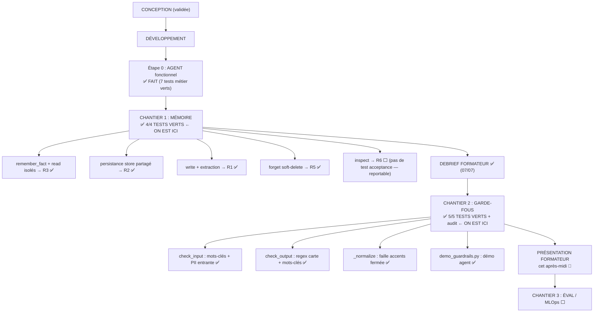

# JOURNAL DE BORD — Développement Velmo 2.0

> Journal vivant, mis à jour à CHAQUE étape. But : retrouver et comprendre pas à pas ce qu'on fait, ce qu'on a fait, et **pourquoi**.
> **Gardé SÉPARÉ du repo** (dans Obsidian) — on le transférera séparément au formateur à la fin.
> Règle : factuel ici (pas d'oral/Q&R — les oraux restent séparés → voir `oral-etat-chantier1-memoire.md`).
> Dernière mise à jour : 2026-07-10 (**CHANTIER 2 : 5/5 VERT** + 2 failles auditées et fermées 🎉).
> Détail du Chantier 2 : `JOURNAL-chantier2-guardrails.md`. Oral : `oral-final-chantier2-FR.md` / `-EN.md`.

---

## 🗺️ Où on en est / Où on va



📖 **Comment lire ce schéma**
- L'agent tourne ✅ et le contrat mémoire est rempli : **R1, R2, R3, R5 tous verts**.
- R6 (`inspect`) n'a pas de test d'acceptance → seul morceau légitimement reportable après le debrief.
- **À retenir** : le minimum attendu par le formateur (Chantier 1) est ATTEINT avant le debrief.

---

## 🎯 Contexte (rappel court)

- **Projet réel (code)** : `C:\Users\kanda\velmo-v2` (fork du squelette formateur `Ganda15/velmo-v2`) — gardé INTACT.
- **Docs à nous (journal, conception, guides)** : gardés SÉPARÉS dans Obsidian `Projets/Velmo/` — transfert séparé.
- **Stack imposée** (`docs/reco_expert.md`) : Postgres (source de vérité des faits) + Chroma (épisodique) + Kimi-K2.6 via Azure + GitHub Actions. SQLite seulement pour les tests hors-ligne.
- **Conseil formateur** : agent fonctionnel d'abord, PUIS la mémoire. Débrief Chantier 1 demain fin d'après-midi (minimum attendu) → **objectif atteint**.
- **Reste à construire** : `inspect()` (R6, optionnel), puis Chantiers 2 et 3.

---

## 📓 Journal des étapes (quoi / qui / pourquoi / résultat)

| # | Étape | Qui | Pourquoi | Résultat |
|---|---|---|---|---|
| 1 | Cloner le fork `velmo-v2` | Claude | Récupérer le vrai squelette (agent déjà branché) | Repo cloné dans `C:\Users\kanda\velmo-v2` |
| 2 | Lire `docs/reco_expert.md` | Era + Claude | La note qui FIXE la stack imposée | Stack tranchée : Postgres + Chroma + Kimi/Azure |
| 3 | Lire `agent.py`, `db.py`, `llm.py`, `memory/__init__.py` | Claude | Comprendre que l'agent existe déjà et appelle déjà `memory.read/write` | Mémoire = un trou à remplir |
| 4 | Diagnostiquer l'environnement (`uv`, Python, Docker) | Claude | « faire l'agent d'abord » = le faire tourner | `uv` + Python 3.11.15 déjà là |
| 5 | `uv sync` (installer les dépendances) | Claude | Sans dépendances l'agent ne tourne pas | SQLAlchemy, psycopg, pytest… installés |
| 6 | `uv run pytest tests/acceptance/test_business.py` | Claude | Prouver que l'agent est fonctionnel AVANT la mémoire | **7 tests métier verts** ✅ |
| 7 | Vérifier `git status` (repo intact) | Era + Claude | S'assurer qu'aucun test/contrat du formateur n'a été modifié | Repo 100% vierge |
| 8 | Apprendre à lancer les tests soi-même (`uv run pytest -v`) | Era | Savoir vérifier vert/rouge en autonomie | Compris : `uv run` + fichier + `-v` |
| 9 | Décider : docs séparés du repo (transfert séparé) | Era | Repo formateur reste propre ; docs à nous dans Obsidian | Journal gardé dans Obsidian |
| 10 | Étape 0 : lancer les 4 tests mémoire | Era + Claude | Voir la « photo de départ » en ROUGE (TDD : le test définit le contrat AVANT le code) | **4 tests rouges** 🔴 — baseline confirmée |
| 11 | Créer `src/velmo/memory/store.py` + coder `read()` et `remember_fact()` dans `memory/__init__.py` | Era + Claude | Les faits doivent survivre aux sessions (R2) et rester isolés par client (R3) → il faut une table persistante | Table `memory_facts` (SQLAlchemy, SQLite partagé / Postgres via `MEMORY_DB_URL`) → **R2 + R3 verts** ✅ (`2 passed, 2 failed`) |
| 12 | Valider la clé Azure Kimi | Era + Claude | L'agent doit parler au vrai modèle, pas à un mock | Vraie réponse reçue du modèle ✅ |
| 13 | Installer extensions VS Code (GitLens, Markdown Mermaid, Python) | Era | Voir l'avant/après du code, les schémas du journal, les tests cliquables | Installées ✅ |
| 14 | Étape 12 : coder `write()` — regex `FACT_PATTERN` (`Ma/Mon <clé> est <valeur>`) + réutilisation de `remember_fact()` | Era + Claude | R1 : une info du tour 1 doit ressortir 30 tours plus tard SANS garder 31 tours (budget 2000 tokens) → on distille chaque échange en faits `clé=valeur` | **R1 vert** ✅ (`3 passed, 1 failed`) |
| 15 | Non-régression après Étape 12 : `uv run pytest -q` | Claude | Vérifier que l'extraction n'a rien cassé | `10 passed` — rouges restants tous attendus |
| 16 | Era relance les tests lui-même et lit l'échec de R5 | Era | Autonomie : lire `assert 0 >= 1` → savoir que `forget()` renvoie 0 | Diagnostic lu correctement ; leçon au passage : le test mesure le DISQUE, pas le chat (un `return 0` non remplacé = toujours rouge) |
| 17 | Étape 13 : coder `forget()` — soft-delete (`deleted=True` sur les faits dont clé OU valeur contient la cible, retour du compte) | Era + Claude | R5 droit à l'oubli : « oublie mon adresse » doit trouver la clé `adresse de livraison` (recherche par inclusion, pas par égalité) et prouver la suppression | **R5 vert** ✅ → **`4 passed` — CHANTIER 1 TERMINÉ** 🎉 (vérifié par Era lui-même) |
| 18 | Non-régression finale : `uv run pytest -q` sur TOUT | Claude | Prouver que le chantier complet n'a rien cassé | `11 passed` — les 8 rouges restants sont TOUS attendus : 5 garde-fous (Chantier 2) + 3 MLOps (Chantier 3) |

---

## 📍 Position actuelle (2026-07-07, après Étape 13)

- **CHANTIER 1 : TERMINÉ** — contrat d'acceptance rempli à 4/4, non-régression vérifiée, prêt pour le debrief.

| Test | Exigence | État |
|---|---|---|
| R1 — rappel sur 30 tours | `write()` extrait les faits des phrases libres (regex `FACT_PATTERN`) | 🟢 |
| R2 — persistance entre sessions | faits relus par une nouvelle session | 🟢 |
| R3 — isolation entre clients | Marc ne voit jamais les données de Sophie | 🟢 |
| R5 — droit à l'oubli | `forget()` soft-delete + renvoie le nombre supprimé | 🟢 |
| R6 — inspection | `inspect()` renvoie l'état mémoire | ⬜ (pas de test acceptance — reportable après debrief) |

- **Choix techniques à assumer à l'oral** : regex = choix minimal honorant le contrat (LLM en prod) ; soft-delete = suppression côté lecture + trace d'audit côté base (RGPD).
- **Prochaine action** : debrief formateur (demain fin d'après-midi). Optionnel avant : `inspect()` (~5 lignes).

---

## 📍 Position actuelle (2026-07-10)

- **CHANTIER 2 : TERMINÉ** — 5 garde-fous verts, non-régression prouvée, **plus deux failles trouvées
  hors tests et fermées** (accents, PII entrante). Voir `JOURNAL-chantier2-guardrails.md` étapes 8 et 9.

| Test garde-fous | État |
|---|---|
| haine / violence / sexuel bloqués + journalisés | 🟢 |
| injection de prompt bloquée | 🟢 |
| n° de carte bloqué **en sortie** | 🟢 |
| hors-périmètre refusé | 🟢 |
| 20 hostiles bloqués, 0 faux positif sur 12 légitimes | 🟢 |
| n° de carte bloqué **en entrée** (exigence brief, hors test) | 🟢 |
| mots-clés insensibles aux accents (hors test) | 🟢 |

- **Prochaine action** : présentation garde-fous au formateur, cet après-midi.
- **Après** : Chantier 3 (MLOps) — `run_eval` est une coquille vide (`mlops/__init__.py:40`,
  `NotImplementedError`), 3 tests rouges attendus. Le journal `self.events` du Chantier 2 en est la
  matière première.

---

## 🔜 Prochaines étapes prévues

1. **Présentation Chantier 2** — schéma gauche → démo agent → code → pytest. Voir `oral-final-chantier2-FR.md`.
2. *(Si le temps le permet)* Lancer une fois contre le vrai Kimi : `uv sync --extra llm`, remplir `.env`,
   vérifier que `get_llm()` renvoie `AzureLLM`. Le brief impose Azure (`reco_expert.md:9` : « aucun modèle local »).
3. **Chantier 3 (MLOps)** — `run_eval`, la note globale, le seuil bloquant en CI (`quality.yml`, étape commentée).
4. *(Dette Chantier 1)* `inspect()` → R6, et la couche épisodique vectorielle Chroma (`reco_expert.md:11`).

---

## 🧪 Rappel — comment tester

Depuis `C:\Users\kanda\velmo-v2` (terminal VS Code : `Terminal → New Terminal`) :

```
.\.venv\Scripts\python.exe docs2\demo_guardrails.py                          # la démo AGENT (à montrer en premier)
.\.venv\Scripts\python.exe -m pytest tests/acceptance/test_guardrails.py -v  # les garde-fous → 5 passed ✅
.\.venv\Scripts\python.exe -m pytest -q                                       # tout (attendu : 16 passed, 3 failed = MLOps)
```
- **`python` tout court échoue** (`ModuleNotFoundError: No module named 'velmo'`) : `pyproject.toml`
  déclare `pythonpath = ["src","tests"]` **sous `[tool.pytest.ini_options]`** — donc pour pytest
  uniquement — et le `python` du PATH n'est pas celui du venv. Toujours appeler `.\.venv\Scripts\python.exe`.
- Replis : `$env:PYTHONPATH = "src"` puis `python ...`, ou `uv run python ...` si AppLocker ne bloque
  pas `uv.exe` aujourd'hui.
- `-v` = affiche chaque test. `PASSED` = vert, `FAILED` = rouge.
