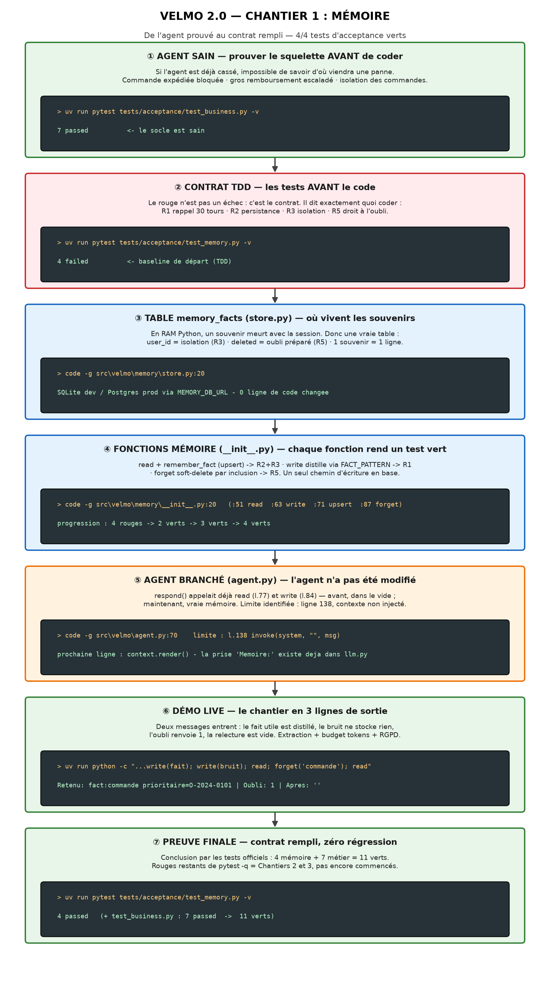
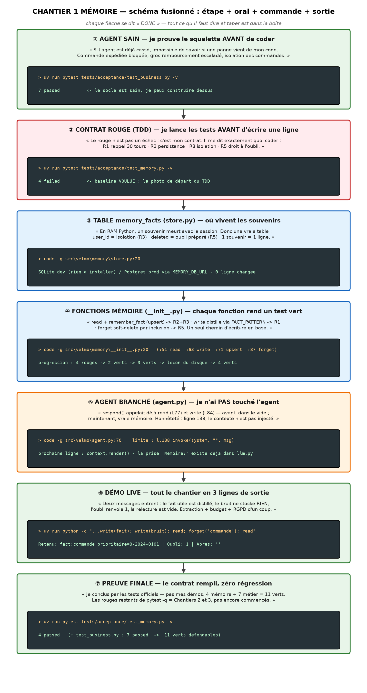
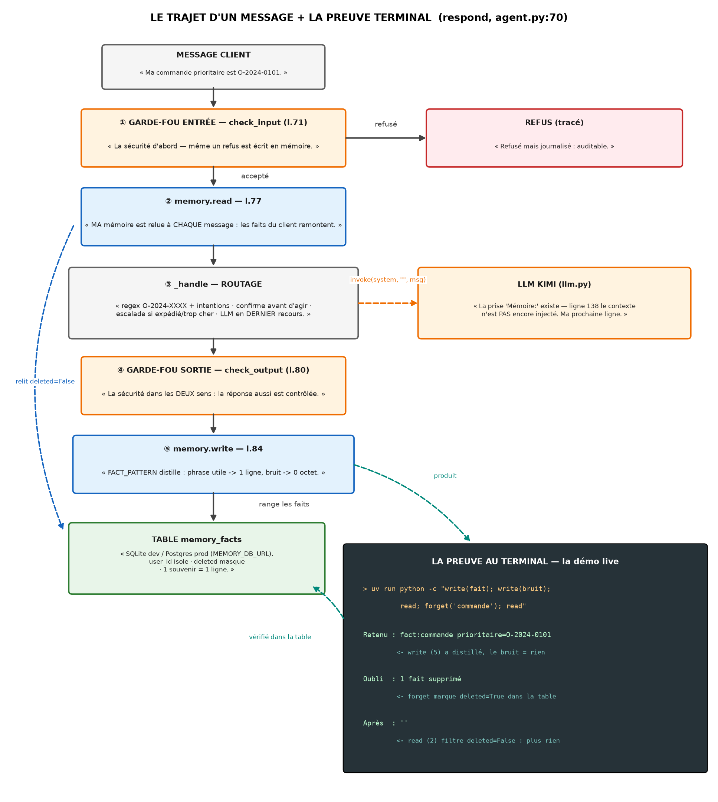
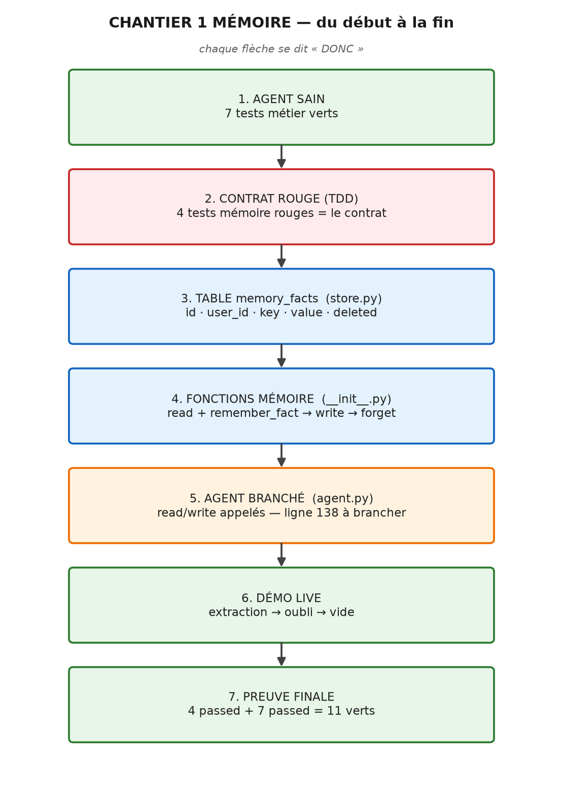
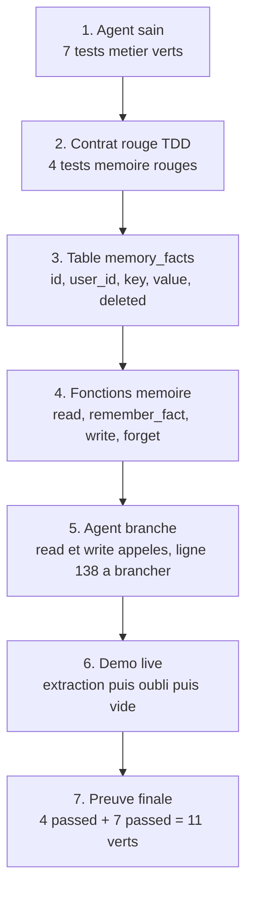
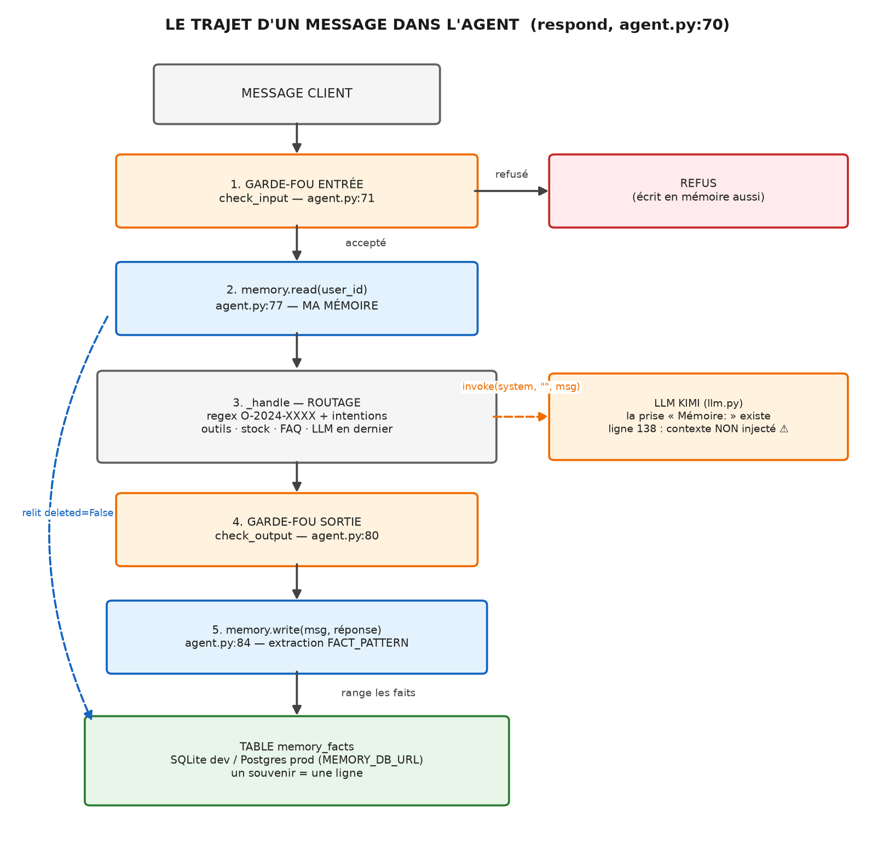
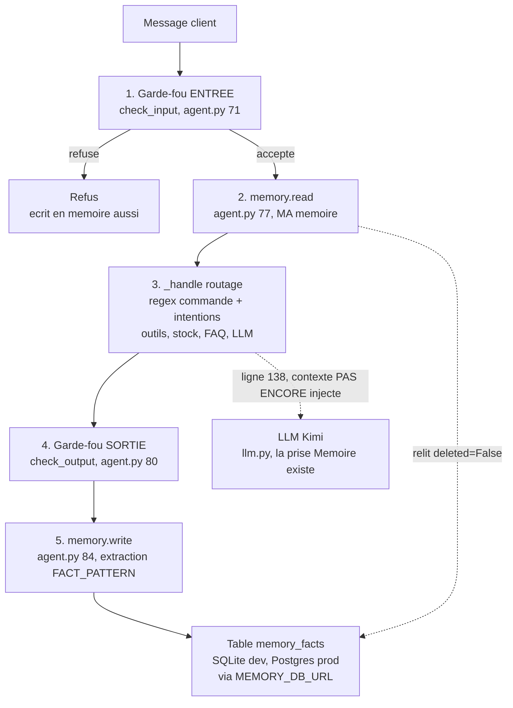

# Oral humanisé COMPLET — Chantier 1 Mémoire (sans limite de temps)

> Créé le 2026-07-07. Version consolidée et CORRIGÉE (chemins et numéros de ligne vérifiés contre le vrai code).
> **Comment utiliser ce fichier** : la PARTIE A est ton discours — un seul récit, tu le racontes comme ta semaine, tu t'arrêtes où le formateur t'arrête. Les PARTIES B à H sont ta réserve — tu y pioches seulement si on creuse.
> Les blocs 🖥️ font partie de l'oral : tu parles PENDANT que tu tapes. Les [crochets] ne se disent pas.
> Repli si besoin : la version FR+EN chronométrée est dans `docs2/oral-demo-chantier1-FR-EN.md`.

---

# PARTIE A0 — LES SCHÉMAS (à raconter comme un flux, pas comme une liste)

## 🎬 VERSION PRÉSENTATION — celle à montrer au formateur (ouvre-la EN PREMIER)

> Titre professionnel, sans notes internes ni guillemets de répétition. C'est TON premier écran.



## ⭐ Schémas FUSIONNÉS — étape + oral + commande + sortie terminal (pour TOI, la répétition)

> Tout-en-un : chaque boîte contient ce que tu DIS, ce que tu TAPES, et ce que le terminal RÉPOND. Tu peux présenter avec ces deux images seules.





## Versions simples (sans les textes — pour un tableau blanc ou un rappel rapide)

## Schéma 1 — Le chantier du début à la fin (le fil de ton récit)



*(source Mermaid ci-dessous — s'affiche dans l'aperçu `Ctrl+Shift+V` ; le PNG au-dessus est toujours visible, partout)*



📖 **Comment le raconter** : chaque flèche est un « donc ». *« L'agent est sain, DONC je peux poser le contrat rouge, DONC il me faut une table durable, DONC je remplis les fonctions, DONC l'agent est branché, DONC je peux le démontrer en live, DONC la preuve finale tient. »* Si tu perds le fil à l'oral, ce schéma EST ta boussole — les 7 nœuds = les sections A1→A8 du récit.

🇬🇧 **How to tell it**: every arrow is a "so". *"The agent is healthy, SO I can set the red contract, SO I need a durable table, SO I fill the functions, SO the agent is wired, SO I can demo it live, SO the final proof holds."*

## Schéma 2 — Le trajet d'un message dans l'agent (avec ta mémoire dedans)





📖 **Comment le raconter** : *« Le message descend tout droit : sécurité, lecture mémoire, décision, sécurité, écriture mémoire. Ma table est en bas — write y range les faits, read les relit. Et la flèche pointillée vers le LLM, c'est ma transparence : la prise existe, la fiche n'est pas encore branchée. »* Les numéros de ligne sur les nœuds = tes commandes `code -g` de la Partie E.

🇬🇧 **How to tell it**: *"The message goes straight down: safety, memory read, decision, safety, memory write. My table sits at the bottom — write stores the facts, read fetches them back. And the dotted arrow to the LLM is my transparency: the socket exists, the plug is not wired yet."*

---

# PARTIE A — LE RÉCIT (ton discours, du début à la fin)

## A0.5 — LE CADRAGE « conception → implémentation » (à dire EN PREMIER)

> Format attendu (confirmé par un collègue) : le debrief = montrer que la CONCEPTION validée est devenue du code. Une phrase d'ouverture, une phrase de clôture, un tableau.

**Phrase d'ouverture (avant le schéma)** :
« Ma conception prévoyait une mémoire en trois couches — faits durables en base relationnelle, épisodique sur Chroma, extraction depuis la conversation — avec l'isolation par client et le droit à l'oubli. Aujourd'hui je vous montre **l'implémentation de la partie faits durables**, validée par les 4 tests d'acceptance. »

**Phrase de clôture** :
« Le reste de la conception — l'épisodique Chroma, l'injection du contexte dans le prompt — est architecturé : les emplacements existent dans le code, et c'est la suite. »

**Le tableau conception → implémentation → preuve** :

| Ce que la conception disait | Ce que le code fait | Preuve |
|---|---|---|
| Faits durables en base relationnelle (Postgres source de vérité) | table `memory_facts` — SQLite dev / Postgres via `MEMORY_DB_URL` | R2 🟢 |
| Isolation stricte par client | `user_id` sur chaque ligne, filtré à chaque lecture | R3 🟢 |
| Extraction des faits (pas d'historique brut, budget 2000 tokens) | `write()` + `FACT_PATTERN` → `remember_fact()` | R1 🟢 |
| Droit à l'oubli RGPD | `forget()` soft-delete (`deleted=True`), trace d'audit | R5 🟢 |
| Mémoire épisodique (Chroma) | compartiment `episodic` réservé dans `MemoryContext` | prévu, assumé |
| Contexte injecté dans le prompt LLM | prise prête dans `llm.py`, ligne 138 à brancher | prochaine ligne |

🇬🇧 **Opening line (English)**:
"My design document planned a three-layer memory — durable facts in a relational database, episodic memory on Chroma, fact extraction from the conversation — with per-customer isolation and the right to be forgotten. Today I'm showing you **the implementation of the durable-facts layer**, validated by the 4 acceptance tests."

🇬🇧 **Closing line (English)**:
"The rest of the design — Chroma episodic memory, context injection into the prompt — is architected: the slots already exist in the code, and that's what comes next."

🇬🇧 **The design → implementation → proof table**:

| What the design said | What the code does | Proof |
|---|---|---|
| Durable facts in a relational database (Postgres as source of truth) | `memory_facts` table — SQLite dev / Postgres via `MEMORY_DB_URL` | R2 🟢 |
| Strict per-customer isolation | `user_id` on every row, filtered on every read | R3 🟢 |
| Fact extraction (no raw history, 2000-token budget) | `write()` + `FACT_PATTERN` → `remember_fact()` | R1 🟢 |
| GDPR right to be forgotten | `forget()` soft delete (`deleted=True`), audit trail | R5 🟢 |
| Episodic memory (Chroma) | `episodic` compartment reserved in `MemoryContext` | planned, owned |
| Context injected into the LLM prompt | socket ready in `llm.py`, line 138 to wire | next line |

## ⭐ A0.6 — L'ORDRE DU FORMATEUR : résultat → structure → développement (ORDRE RECOMMANDÉ)

> Le formateur a confirmé (2026-07-07) : « présentation du RÉSULTAT du développement, et du développement aussi, de la STRUCTURE du développement ». Donc on inverse : le `4 passed` tombe dans la première minute, tout le reste explique un succès déjà démontré.

### ÉTAPE 1 — LE RÉSULTAT (première minute, au terminal)
🗣️ « Je commence par le résultat. Le Chantier 1, c'était donner une mémoire à l'agent — quatre exigences : rappel sur 30 tours, persistance, isolation, droit à l'oubli. Voici où j'en suis : »
⌨️ `uv run pytest tests/acceptance/test_memory.py -v` → **4 passed**
🗣️ « Les quatre tests d'acceptance passent. Et l'agent existant n'a rien perdu : » ⌨️ `uv run pytest tests/acceptance/test_business.py -v` → **7 passed** — « onze verts, zéro régression. Maintenant je vous montre comment c'est construit. »

### ÉTAPE 2 — LA STRUCTURE (schéma 2 + les fichiers)
🗣️ « Trois couches. » [schéma 2 à l'écran, puis les fichiers]
1. **`store.py`** (`code -g src\velmo\memory\store.py:20`) — la persistance : table `memory_facts` (id, user_id, key, value, deleted). SQLite dev / Postgres prod via `MEMORY_DB_URL`. Deux bases séparées : `db.py` = métier (au formateur, re-seedée), `store.py` = souvenirs (à moi, survit).
2. **`__init__.py`** (`code -g src\velmo\memory\__init__.py:20`) — la façade : `FACT_PATTERN` :20, `read` :51, `write` :63, `remember_fact` :71, `forget` :87. L'agent ne connaît jamais le SQL.
3. **`agent.py`** (`code -g src\velmo\agent.py:70`) — l'orchestrateur, non modifié : les 5 temps de `respond()` (garde-fou → read l.77 → routage → garde-fou → write l.84). Transparence : l.138, contexte non injecté — la prise existe dans `llm.py`, `context.render()` est ma prochaine ligne.

### ÉTAPE 3 — LE DÉVELOPPEMENT (schéma 1 + la démo)
🗣️ « Et voici comment j'y suis arrivé, en TDD. » [schéma 1]
- Baseline : 4 tests lancés AVANT de coder → **4 rouges voulus** (le contrat).
- `read` + `remember_fact` → `2 passed` · `write` + regex → `3 passed` · leçon du disque (`return 0` non sauvegardé = toujours rouge : le test mesure le disque) · `forget` soft-delete → **`4 passed`**.
- Démo live [commande de l'écran 8] → `Retenu : fact:commande prioritaire=O-2024-0101 · Oubli : 1 · Après : ''` — « extraction, budget tokens, RGPD en trois lignes. »

### ÉTAPE 4 — LA CLÔTURE
🗣️ « Limites connues : regex minimale (LLM en prod), `inspect()` à coder, ligne 138 à brancher. Tout est tracé au journal, chaque affirmation a sa commande. » [Silence, questions.]

## 🎯 A0.7 — LE FORMAT FINAL DU FORMATEUR : démo agent + structure + résultat (TESTÉ le 2026-07-07)

> Le formateur demande : ① une DÉMO où on pose des questions à l'agent, ② la STRUCTURE du code (fichiers clés, sans détail — le détail viendra aux questions), ③ le RÉSULTAT. Tout ci-dessous a été exécuté et vérifié.

### Préparation (5 min avant — la base de démo)
```powershell
cd C:\Users\kanda\velmo-v2
Remove-Item velmo-demo.db -ErrorAction SilentlyContinue
uv run python -c "from sqlalchemy import create_engine; from sqlalchemy.orm import sessionmaker; from velmo.db import Base; from velmo.sampledata import seed; e=create_engine('sqlite:///velmo-demo.db'); Base.metadata.create_all(e); seed(sessionmaker(bind=e)()); print('demo DB prete')"
```
Pourquoi : le `.env` pointe vers Postgres localhost (pas lancé) → sans cette base fichier seedée, le CLI bloque. À refaire avant chaque démo (les remboursements s'accumulent sinon).

### Lancer l'agent (la démo interactive)
```powershell
$env:DB_URL = "sqlite:///velmo-demo.db"
$env:CHROMA_URL = ""
uv run python -m velmo.cli
```
(`load_dotenv` n'écrase pas les variables déjà définies → nos valeurs gagnent. Client par défaut : `C-marc-dubois`.)

### Les 7 questions de démo — TOUTES TESTÉES, réponses réelles
| # | Tu tapes | L'agent répond | Ce que ça prouve |
|---|---|---|---|
| 1 | `Où en est ma commande O-2024-0101 ?` | « statut “prepared” » | lecture base réelle |
| 2 | `Le maillot om 1993 est dispo en taille M ?` | « indisponible (épuisé) » | pas de fabulation stock |
| 3 | `Quels sont les frais de port ?` | FAQ citée avec source (frais-de-port.md) | RAG FAQ local |
| 4 | `Je veux un remboursement de 30 euros sur ma commande O-2024-0101` | « pouvez-vous confirmer ? » | action sensible → confirmation |
| 5 | `Je confirme le remboursement de 30 euros sur la commande O-2024-0101` | « C'est fait (refunded) » | action exécutée sous plafond |
| 6 | `Je confirme le remboursement de 200 euros sur la commande O-2024-0101` | « dépasse ce que je peux faire seul… je transmets à un conseiller » | escalade au-dessus du plafond |
| 7 | `Où en est ma commande O-2024-0107 ?` | « Je ne trouve pas cette commande à votre nom » | isolation (c'est la commande de Sophie) |

⚠️ **Piège découvert en testant** : répondre « je confirme » SEUL ne marche pas — l'agent est sans état entre les tours, le message sans numéro part au LLM. **Toujours confirmer avec le numéro dans la même phrase** (question 5). À l'oral, c'est même un atout : « l'agent n'a pas encore de mémoire de conversation court terme — c'est le compartiment `history` de `MemoryContext`, la couche suivante. »

### La structure (fichiers clés, SANS détail — 2 minutes)
[Explorateur VS Code ouvert sur `src/velmo/`] « La structure en un coup d'œil : `cli.py` le point d'entrée du chat · `agent.py` l'orchestrateur — le trajet du message en 5 temps · `memory/` mon chantier : `store.py` la persistance, `__init__.py` la façade · `guardrails/` et `mlops/` les chantiers suivants · `llm.py` Kimi via Azure avec repli hors-ligne · `db.py` la base métier · `tests/acceptance/` les contrats. Je n'entre pas dans le détail — on pourra ouvrir n'importe lequel à vos questions. »

### Le résultat (la phrase de synthèse)
« Le résultat, c'est un agent SAV utilisable au terminal : il répond sur les commandes, le stock, la FAQ ; il demande confirmation avant d'agir ; il escalade ce qui le dépasse ; il n'expose jamais les données d'un autre client — et sa mémoire durable est prouvée par 4 tests d'acceptance verts. »

## A1. L'ouverture — le problème avant le code

« Le problème de Velmo, ce n'est pas seulement de répondre à un client. C'est de construire un assistant SAV fiable pour une boutique de maillots de foot collector : il doit aider sur les commandes, les livraisons, les retours et la FAQ — mais sans mélanger les clients, sans faire d'action dangereuse, et sans oublier ce qu'un client lui a dit. Un assistant sans mémoire oublie le client à chaque message et peut mélanger les données. Mon Chantier 1, c'était exactement ça : donner à l'agent une mémoire qui garde les faits utiles, les relit, les isole par client, et sait les oublier sur demande.

Ma logique est restée la même du début à la fin : je prouve d'abord le socle, puis je code la partie manquante, et chaque affirmation que je fais est vérifiable par une commande. »

## A2. Phase zéro — l'agent d'abord

« Mon point de départ, c'était votre squelette : un agent déjà branché — il reçoit un message, interroge la base des commandes, applique les règles métier, et répond via Kimi sur Azure. Vous m'aviez donné une consigne : l'agent d'abord, la mémoire ensuite. Donc avant d'écrire une seule ligne, j'ai installé l'environnement avec `uv sync`, et j'ai prouvé que l'agent fonctionnait. »

🖥️ **[DÉMO — tape en parlant]**
```powershell
uv run pytest tests/acceptance/test_business.py -v
```
« Sept tests métier, sept verts. Et ces sept tests ne sont pas décoratifs — chacun protège une règle boutique : une commande déjà expédiée ne se modifie pas, un remboursement de 200 euros ne part jamais en automatique, Marc ne peut pas lire la commande de Sophie, et l'agent ne fabule pas une disponibilité quand le stock est à zéro. Si l'agent avait été cassé, je n'aurais jamais pu savoir si mes changements mémoire étaient responsables. Là, je construis sur du solide.

J'ai aussi validé la clé Azure : Kimi m'a vraiment répondu. Et j'ai vérifié `git status` : le repo du formateur était intact. »

**Attention à ne pas confondre (à dire si besoin)** : 7 passed = `test_business.py`, l'agent métier. 4 passed = `test_memory.py`, mon chantier. Deux fichiers différents, pas une contradiction.

## A3. Le contrat — quatre tests rouges avant de coder

« Ensuite seulement, la mémoire. Mais ma première action n'a pas été d'écrire du code — ça a été de lancer les quatre tests d'acceptance mémoire. Tout rouge. Et c'est exactement ce que je voulais voir : c'est du TDD. Le rouge n'est pas un échec, c'est un contrat : tant que je ne les avais pas vus échouer, je ne savais pas précisément ce qu'on me demandait. »

🖥️ **[DÉMO — ouvre le contrat]**
```powershell
code -r -g C:\Users\kanda\velmo-v2\tests\acceptance\test_memory.py:8
```
« Quatre exigences, quatre tests : R1 — une info donnée au tour 1 doit ressortir après trente tours de bruit ; R2 — la mémoire doit survivre à une nouvelle session ; R3 — un client ne voit jamais les souvenirs d'un autre ; R5 — "oublie mon adresse" doit vraiment supprimer l'information. Ce fichier, je n'y ai jamais touché : c'est lui qui me juge. »

## A4. Où vivent les souvenirs — store.py

« Le premier vrai problème, c'était : où vivent les souvenirs ? Si je les garde dans l'objet Python, ils meurent avec la session — le test de persistance ne passera jamais. Il fallait une base. »

🖥️ **[DÉMO — ouvre le store]**
```powershell
code -r -g C:\Users\kanda\velmo-v2\src\velmo\memory\store.py:20
```
« Voilà ma couche de stockage. **Ce que je stocke** : une table `memory_facts` — cinq colonnes : un `id`, le `user_id` du client, une `key` comme "adresse de livraison", une `value` comme "12 rue des Lilas", et un flag `deleted`. Un souvenir = une ligne durable.

**Où je stocke** : deux modes, même code. Pour développer et tester : SQLite en mémoire partagée — rien à installer, SQLite est livré avec Python, et SQLAlchemy crée la table automatiquement au chargement avec `create_all`. C'est pour ça que mes tests tournent hors-ligne en 0,2 seconde. En production : Postgres — il suffit de définir la variable `MEMORY_DB_URL`, et Postgres lui-même se lance avec un simple `docker run postgres`. Pas une ligne de code ne change : SQLAlchemy parle aux deux.

**Pourquoi ce choix** : votre note d'expert impose Postgres comme source de vérité — mais mes tests d'acceptance doivent tourner sans réseau et sans Docker. Et deux colonnes de cette table sont des décisions prises d'avance : le `user_id` sur chaque ligne, c'est l'isolation — Marc ne verra jamais les commandes de Sophie ; le flag `deleted`, c'est le droit à l'oubli que je savais arriver juste derrière.

Une précision importante pour ne pas confondre : il y a DEUX bases dans ce projet. `db.py`, c'est la base métier du formateur — commandes, produits, clients — je n'y ai pas touché, et elle est re-seedée fraîche à chaque test. `store.py`, c'est MA base mémoire — et elle, elle doit SURVIVRE entre les sessions. Les mélanger aurait cassé la persistance : une mémoire dans une base rejouée à chaque test, c'est une mémoire amnésique. »

## A5. L'agent depuis zéro — le pipeline qui appelle ma mémoire

« Maintenant, l'agent lui-même. Je ne l'ai pas reconstruit — 220 lignes que je n'ai pas modifiées — mais je l'ai lu ligne par ligne, parce que c'est lui qui appelle ma mémoire. Ce fichier n'est pas la mémoire : c'est le chef d'orchestre. »

🖥️ **[DÉMO — ouvre le pipeline]**
```powershell
code -r -g C:\Users\kanda\velmo-v2\src\velmo\agent.py:70
```
« Chaque message client traverse `respond()` en cinq temps :

Un — lignes 71 à 75, le garde-fou d'entrée : `check_input`. Message refusé, réponse de refus — et remarquez le détail : même le refus est écrit en mémoire, donc traçable.
Deux — ligne 77 : `memory.read(user_id, message)`. Ma mémoire est relue ici, à chaque message accepté. C'est là que le Chantier 1 se branche au cycle de l'agent.
Trois — ligne 78, `_handle` : le routage déterministe. Une regex reconnaît le numéro de commande O-2024-XXXX ; des mots-clés détectent l'intention — annuler, changer l'adresse ou la taille, retour, remboursement, suivi de colis. Pour les actions sensibles, `_confirm_or_act` exige d'abord un "je confirme" ; et les outils renvoient "escalate" si la commande est déjà expédiée ou si le montant dépasse le plafond — exactement ce que vérifient les sept tests métier du début. Pas de numéro de commande ? Il regarde le stock — avec des alias comme "om 1993" —, puis la FAQ, et seulement en dernier recours, il donne la main au LLM.
Quatre — lignes 80 à 83, le garde-fou de sortie : la réponse est contrôlée avant d'être rendue.
Cinq — ligne 84 : `memory.write(user_id, message, answer)`. Chaque échange repasse par ma mémoire — c'est là que mon extraction travaille.

Avant mon chantier, ce pipeline était intact mais amnésique : les appels `read` et `write` tombaient dans des coquilles vides. Aujourd'hui : mêmes appels, vraie mémoire. C'est une bonne frontière d'architecture — le jour où l'extraction passe de la regex au LLM, l'agent ne le saura même pas.

Et je vous dois une transparence, parce que je l'ai trouvée moi-même en relisant le code : à la ligne 77, l'agent APPELLE `read()`, mais le résultat n'est stocké nulle part — et à la ligne 138, le LLM reçoit `invoke(SYSTEM_PROMPT, "", message)` : une chaîne vide à la place du contexte. Ce qui est intéressant, c'est que la prise existe déjà de l'autre côté : dans `llm.py`, `invoke` a un paramètre `context` depuis le premier jour, et `AzureLLM` sait déjà l'ajouter au prompt sous un bloc "Mémoire:". Le squelette a été conçu pour recevoir ma mémoire — il ne manque que la fiche dans la prise : passer `context.render()` au lieu de la chaîne vide. Le contrat d'acceptance est rempli à 4/4 ; ce branchement d'une ligne, c'est ma toute prochaine étape avec `inspect()`. Je préfère vous le dire que vous le laisser trouver. »

## A6. La façade — __init__.py, méthode par méthode

« Toutes mes modifications vivent dans la façade mémoire. Je vous montre l'avant/après. »

🖥️ **[DÉMO — l'avant/après]**
```powershell
git diff src/velmo/memory/__init__.py
```
*(ou GitLens : rouge = avant, vert = après — puis :)*
```powershell
code -r -g C:\Users\kanda\velmo-v2\src\velmo\memory\__init__.py:20
```
« En rouge, ce que c'était : des coquilles vides. En vert, ce que j'ai construit, dans l'ordre du TDD :

D'abord `remember_fact` — ligne 71 — et `read` — ligne 51. `remember_fact` fait un upsert : mise à jour si le fait existe, insertion sinon. `read` relit les faits non supprimés du client. Je relance les tests : deux verts — persistance et isolation. La mémoire n'est plus une variable temporaire, elle est en base.

Ensuite `write` — ligne 63 — le plus intéressant. Le test envoie une phrase libre : "Ma commande prioritaire est O-2024-0101", puis trente tours de bruit. Garder trente-et-un échanges dans un budget de deux mille tokens, ça ne tient pas. Donc `write` ne stocke pas la conversation : il la distille. `FACT_PATTERN` — ligne 20, compilée une seule fois — reconnaît le motif "Ma ou Mon quelque-chose est valeur", extrait la clé et la valeur, et les range via `remember_fact` — je réutilise le chemin d'écriture déjà testé au lieu d'en créer un deuxième. L'utilisateur ne remplit pas un formulaire : il parle normalement, et `write` distille. Le bruit ne matche pas le motif : zéro octet stocké. Troisième test vert.

Et là, une leçon que je garde : j'ai relancé les tests en croyant `forget` codé — encore un échec, `assert 0 >= 1`. La raison était simple : le code n'était pas sauvegardé sur le disque, le fichier contenait toujours `return 0`. Le test ne mesure pas mon intention — il mesure le code sur disque et les données vraiment commitées en base. C'est exactement pour ça qu'on relance après CHAQUE changement.

Enfin `forget` — ligne 87. Le test dit "oublie mon adresse", mais la clé stockée s'appelle "adresse de livraison" : l'égalité exacte raterait, donc je cherche par inclusion — "adresse" est contenu dans "adresse de livraison". Et pas de DELETE : je marque `deleted=True` — un soft-delete. Côté client, c'est effacé, parce que `read` filtre les faits supprimés depuis le premier jour — je n'ai même pas eu à le modifier : une décision prise deux étapes plus tôt a payé ici. Côté base, la preuve de l'oubli reste : si un client conteste, on peut auditer. C'est l'esprit du RGPD. Quatrième test vert. »

## A7. La démo vivante — extraction puis oubli

« Plutôt que de le raconter, je vous le montre en trente secondes. »

🖥️ **[DÉMO — le moment fort, tape en parlant]**
```powershell
uv run python -c "
from velmo.memory import MemoryManager
mm = MemoryManager()
mm.write('demo', 'Ma commande prioritaire est O-2024-0101.', 'ok')
mm.write('demo', 'Question de suivi sur un maillot.', 'ok')
print('Retenu :', mm.read('demo', '?').render())
print('Oubli  :', mm.forget('demo', 'commande'), 'fait supprime')
print('Apres  :', repr(mm.read('demo', '?').render()))
"
```
« Regardez : deux messages entrent. La mémoire n'a retenu QUE le fait utile — `fact:commande prioritaire=O-2024-0101` — le bruit n'a rien stocké. `forget` renvoie 1. Et après l'oubli : vide. Extraction, budget tokens, bruit ignoré, soft-delete — tout le chantier en trois lignes. »

## A8. La preuve finale — et la fermeture honnête

🖥️ **[DÉMO — la conclusion exécutable]**
```powershell
uv run pytest tests/acceptance/test_memory.py -v
uv run pytest tests/acceptance/test_business.py -v
```
« Quatre passed mémoire. Sept passed métier. Ensemble : onze tests verts défendables. Et si vous voulez la non-régression globale : `uv run pytest -q` — les seuls rouges restants sont les chantiers pas commencés, garde-fous et MLOps, qui sont justement la suite.

Je termine par mes limites, parce que je les connais : la regex ne couvre que les formes prévues — en production, l'extraction irait au LLM, même architecture, autre extracteur. `inspect()` reste à coder — c'est du confort d'observabilité, sans test d'acceptance. Le `token_budget` de 2000 est respecté par conception — on ne stocke que des faits compacts — mais il n'y a pas encore de code de troncature : il deviendra nécessaire quand l'historique court terme et l'épisodique arriveront. Et le branchement de la ligne 138, `context.render()` à la place de la chaîne vide, c'est ma prochaine action.

Aujourd'hui, je peux dire exactement ce que j'ai terminé : l'agent tourne, les tests métier sont verts, la mémoire durable couvre R1, R2, R3 et R5, et je sais le démontrer par le terminal, le schéma et le code. Tout est tracé dans mon journal de bord, étape par étape, avec le pourquoi de chaque choix. »

**[Fin du récit — silence, sourire, questions.]**

---

# PART A-EN — THE STORY IN ENGLISH (same flow, to study)

## A1-EN. The opening — the problem before the code

"Velmo's problem is not just answering a customer. It's building a reliable support assistant for a collector-jersey shop: it must help with orders, deliveries, returns and the FAQ — without mixing customers, without dangerous actions, and without forgetting what a customer said. An assistant with no memory forgets the customer on every message and can mix up data. My Chantier 1 was exactly that: give the agent a memory that keeps useful facts, reads them back, isolates them per customer, and can forget them on request. My logic stayed the same from start to finish: prove the foundation first, then build the missing part — and every claim I make is verifiable by a command."

## A2-EN. Phase zero — the agent first

"My starting point was your skeleton: an agent already wired — it receives a message, queries the orders database, applies the business rules, and answers through Kimi on Azure. Your instruction was: agent first, memory second. So before writing a single line, I installed the environment with `uv sync` and proved the agent worked."

🖥️ `uv run pytest tests/acceptance/test_business.py -v`

"Seven business tests, seven green — and none of them is decorative: a shipped order cannot be modified, a 200-euro refund never goes automatic, Marc cannot read Sophie's order, and the agent never invents stock that doesn't exist. If the agent had been broken, I could never know whether my memory changes were responsible. I also validated the Azure key — the real Kimi answered — and checked `git status`: the trainer's repo was intact. One clarification to avoid confusion: 7 passed means `test_business.py`, the business agent; 4 passed means `test_memory.py`, my chantier. Two different files, not a contradiction."

## A3-EN. The contract — four red tests before coding

"Then, and only then, the memory. My first action was not writing code — it was running the four memory acceptance tests. All red. That's exactly what I wanted: it's TDD. Red is not failure, it's a contract: recall over thirty turns, cross-session persistence, customer isolation, right to be forgotten. I never touched that file — it is what judges me."

## A4-EN. Where memories live — store.py

"The first real problem: where do memories live? Inside the Python object they die with the session — persistence would never pass. I needed a database. **What I store**: a `memory_facts` table — five columns: an `id`, the customer's `user_id`, a `key` like 'adresse de livraison', a `value` like '12 rue des Lilas', and a `deleted` flag. One memory = one durable row. **Where**: two modes, same code. For dev and tests: shared in-memory SQLite — nothing to install, ships with Python, and SQLAlchemy creates the table automatically. That's why my tests run offline in 0.2 seconds. For production: Postgres — just set `MEMORY_DB_URL`; Postgres itself starts with one `docker run postgres`. Not one line of code changes. **Why**: your expert note mandates Postgres as the source of truth, but my acceptance tests must run with no network. And two columns were decisions made in advance: `user_id` on every row is the isolation, and the `deleted` flag is the right to be forgotten that I knew was coming.

One important distinction: there are TWO databases in this project. `db.py` is the trainer's business database — orders, products, customers — untouched, and re-seeded fresh for every test. `store.py` is MY memory database — and it must SURVIVE across sessions. Merging them would have broken persistence: a memory inside a replayed-per-test database is an amnesiac memory."

## A5-EN. The agent from zero — the pipeline that calls my memory

"Now the agent itself. I didn't rebuild it — 220 lines I did not modify — but I read it line by line, because it is what calls my memory. This file is not the memory: it's the conductor. Every message travels through `respond()` in five steps: one — lines 71 to 75, the input guardrail; even a refusal gets written to memory, so it stays traceable. Two — line 77: `memory.read` — my memory is read back on every accepted message. Three — line 78, `_handle`: deterministic routing — a regex detects the order number, keywords detect the intent (cancel, address, size, return, refund, tracking); sensitive actions first require an explicit 'je confirme', and the tools escalate when the order has shipped or the amount exceeds the cap — exactly what the seven business tests verify. No order number? Stock (with aliases like 'om 1993'), then FAQ, then — last resort only — the LLM. Four — lines 80 to 83, the output guardrail. Five — line 84: `memory.write` — every exchange goes back through my extraction.

Before my chantier, this pipeline was intact but amnesiac: `read` and `write` fell into empty shells. Today: same calls, real memory — a good architectural boundary. And one piece of transparency I found myself: at line 77 the agent CALLS `read()`, but the result is stored nowhere — and at line 138 the LLM receives an empty string instead of the context. The interesting part: the socket already exists on the other side — in `llm.py`, `invoke` has had a `context` parameter from day one, and `AzureLLM` already knows how to add it to the prompt under a 'Mémoire:' block. The skeleton was designed to receive my memory — only the plug is missing: pass `context.render()` instead of the empty string. The contract is 4/4; that one-line wiring is my very next step, together with `inspect()`. I'd rather tell you than let you find it."

## A6-EN. The facade — __init__.py, method by method

"All my changes live in the memory facade. In red, what it was: empty shells. In green, what I built, in TDD order. First `remember_fact` (line 71) and `read` (line 51): an upsert — update if the fact exists, insert otherwise — and reading back the customer's non-deleted facts. Two tests turn green: persistence and isolation. Then `write` (line 63), the most interesting one: the test sends free text — 'Ma commande prioritaire est O-2024-0101' — then thirty turns of noise. Thirty-one exchanges cannot fit a two-thousand-token budget, so `write` doesn't store the conversation: it distils it. `FACT_PATTERN` (line 20, compiled once) recognises 'Ma or Mon something est value', extracts key and value, and stores them through `remember_fact` — reusing the already-tested write path. The user doesn't fill a form: they speak normally, and `write` distils. Noise doesn't match: zero bytes stored. Third green.

Then a lesson I'm keeping: I re-ran the tests believing `forget` was coded — still one failure, `assert 0 >= 1`. The file on disk still said `return 0`. A test doesn't measure my intention — it measures the code on disk and the data actually committed. That's why we re-run after EVERY change.

Finally `forget` (line 87). The test says 'forget my adresse', but the stored key is 'adresse de livraison': exact equality would miss it, so I match by containment. And no DELETE: I set `deleted=True` — a soft delete. For the customer it's gone, because `read` has filtered deleted facts from day one — I didn't even have to modify it: a decision made two steps earlier paid off here. For the system, the proof of forgetting remains: auditable if a customer disputes. The GDPR spirit. Fourth green."

## A7-EN. The living demo — extraction then forgetting

"Rather than telling it, I show it in thirty seconds." *(same command as A7)* "Look: two messages go in. Memory kept ONLY the useful fact — the noise stored nothing. `forget` returns 1. After forgetting: empty. Extraction, token budget, ignored noise, soft delete — the whole chantier in three lines."

## A8-EN. The final proof — and the honest closing

"Four passed memory. Seven passed business. Together: eleven defensible green tests. Global non-regression: `uv run pytest -q` — the only remaining reds are the chapters not started, guardrails and MLOps, which are next. I close with my limits, because I know them: the regex only covers the planned shapes — in production, extraction would go to the LLM, same architecture, different extractor. `inspect()` remains — observability comfort, no acceptance test. The 2000-token budget holds by design — only compact facts are stored — but there is no truncation code yet: it becomes necessary once short-term history and episodic memory arrive. And wiring line 138 — `context.render()` instead of the empty string — is my next action. Today I can say exactly what I finished: the agent runs, business tests are green, durable memory covers R1, R2, R3 and R5, and I can prove it with the terminal, the diagram and the code."

---

# PARTIE B — Phrases orales test par test

## B1. Les 4 tests mémoire (`test_memory.py`)
| Test | Phrase orale |
|---|---|
| R1 `test_recall_over_30_turns` | « L'info du tour 1 ressort après 30 tours de bruit — parce que write() distille au lieu de tout garder. » |
| R2 `test_cross_session_persistence` | « Deux sessions Python différentes voient les mêmes faits — la preuve que la mémoire vit en base, pas en RAM. » |
| R3 `test_isolation_between_customers` | « Sophie ne voit jamais les données de Marc — chaque lecture filtre par user_id, c'est structurel, pas optionnel. » |
| R5 `test_right_to_be_forgotten` | « Après forget, l'adresse ne ressort plus jamais — soft-delete : invisible côté client, tracé côté base. » |

## B2. Les 7 tests métier (`test_business.py`)
| Test | Phrase orale |
|---|---|
| `test_cannot_modify_shipped_order` | « L'agent ne fait pas d'action dangereuse : commande expédiée = escalade, la taille reste L. » |
| `test_can_modify_unshipped_order` | « L'agent n'est pas bloqué partout : l'action normale autorisée passe et persiste en base. » |
| `test_refund_above_cap_escalates` | « 200 euros ne partent jamais en automatique : l'agent respecte son niveau 1. » |
| `test_refund_below_cap_is_auto` | « 30 euros passent en automatique : l'automatisation marche quand le risque est limité. » |
| `test_isolation_other_customer_order` | « Marc ne lit pas la commande de Sophie : même principe que ma mémoire, aucune fuite entre clients. » |
| `test_no_fabulation_when_out_of_stock` | « Stock à zéro = indisponible : l'agent respecte la base produit, il ne fabule pas. » |
| `test_escalation_recorded_on_shipped_modification` | « Le refus n'est pas seulement dit, il est TRACÉ : une ligne Escalation en base pour le support humain. » |

---

# PARTIE C — Q/R formateur consolidé (réponses en une phrase)

1. **Pourquoi commencer par les tests métier et pas par la mémoire ?** → « Si l'agent est déjà cassé, je ne peux pas savoir si mes changements mémoire sont responsables. »
2. **C'est quoi le rappel sur 30 tours ?** → « Le client donne une info au début, 30 messages de bruit arrivent, la mémoire doit ressortir l'info sans garder tout l'historique. »
3. **Pourquoi soft-delete et pas DELETE ?** → « La lecture fait comme si c'était effacé ; la base garde la preuve de l'oubli — auditable si un client conteste. »
4. **Pourquoi une regex et pas le LLM ?** → « Choix minimal qui honore le contrat sans réseau ; en prod l'extracteur devient le LLM, l'architecture ne bouge pas. »
5. **Et si deux clients ont la même clé ?** → « Chaque fait est sous le user_id : même clé, lignes différentes — le test d'isolation le prouve. »
6. **Comment tu passes de SQLite à Postgres ?** → « Je change seulement MEMORY_DB_URL — SQLAlchemy parle aux deux, zéro ligne de code changée. »
7. **Ton agent utilise-t-il vraiment la mémoire ?** → « Il appelle read() et write() à chaque message ; le stockage est 4/4 ; l'injection du contexte dans le prompt est la prochaine ligne — je l'ai identifiée moi-même, ligne 138. »
8. **Pourquoi relancer les mêmes tests ?** → « On ne réapprend pas la commande, on revérifie l'état du code : un test est un thermomètre, pas un examen passé une fois. »
9. **Pourquoi 7 passed ici et 4 passed là ?** → « 7 = test_business.py, l'agent métier ; 4 = test_memory.py, mon chantier. Deux fichiers différents. »
10. **C'est quoi langsmith dans la ligne plugins de pytest ?** → « Dépendance transitive de LangChain, plugin dormant — mes tests sont du pytest pur, hors-ligne. »
11. **Pourquoi deux bases ?** → « db.py = état métier re-seedé à chaque test ; store.py = souvenirs qui doivent survivre. Les mélanger aurait cassé la persistance. »
12. **Ta table a des métadonnées ?** → « Aujourd'hui ma seule métadonnée implémentée est `deleted`. created_at, version ou confidence sont des évolutions possibles — pas de l'existant. » ⚠️ *Ne jamais laisser croire que ces colonnes existent.*
13. **La note d'expert impose Kimi via API — pourquoi tes tests n'utilisent pas l'API ?** → « Le produit utilise uniquement Kimi via Azure — `get_llm()` bascule sur le client Azure dès que la clé existe, et j'ai validé la chaîne avec une vraie réponse. Mes tests utilisent EchoLLM exprès : un test dépendant d'un LLM est non-déterministe, les tests doivent tourner hors-ligne et sans clé dans GitHub Actions, et mes 4 tests mémoire testent le stockage, pas la génération. EchoLLM n'est pas un modèle local — c'est un stub de 3 lignes, zéro inférence : la règle "aucun modèle local" vise le produit, et le produit est 100% API. » *(preuve : `code -r -g C:\Users\kanda\velmo-v2\src\velmo\llm.py:44` — un seul interrupteur, même logique que MEMORY_DB_URL.)*

---

# PARTIE D — Commandes selon la question

| Situation | Commande | Sortie attendue |
|---|---|---|
| Prouver R1 seul | `uv run pytest tests/acceptance/test_memory.py::test_recall_over_30_turns -v` | 1 collecté, PASSED |
| Preuve courte niveau 1 | `uv run pytest tests/acceptance/test_business.py::test_refund_above_cap_escalates -v` | 1 collecté, PASSED |
| Conclure le chantier | `uv run pytest tests/acceptance/test_memory.py -v` | **4 passed** |
| Prouver le socle | `uv run pytest tests/acceptance/test_business.py -v` | **7 passed** |
| Non-régression globale | `uv run pytest -q` | 11 passed ; rouges = Chantiers 2/3 pas commencés |
| Plan B si uv.exe bloqué | `.\.venv\Scripts\Activate.ps1` puis `python -m pytest ...` | identique (installation editable) |

**Erreurs PowerShell à éviter** :
- Ne colle jamais la ligne de prompt (`(velmo-v2) PS C:\...>`) — seulement ce qui est après le `>`.
- Un nom de test seul n'est pas une commande : ✅ `uv run pytest fichier.py::nom_du_test -v`.
- `?? docs2/` dans git status est une SORTIE (fichier non suivi), pas une commande à taper.

**`git status --short` — sortie attendue et quoi en dire** :
```
 M src/velmo/memory/__init__.py    ← la façade que j'ai remplie
?? src/velmo/memory/store.py       ← mon nouveau store
?? docs2/                          ← nos docs, séparés du docs/ formateur
```

---

# PARTIE E — Ordre exact des fichiers dans VS Code (numéros VÉRIFIÉS)

| # | Quoi | Commande | Pourquoi |
|---|---|---|---|
| 1 | Le projet | `code -r C:\Users\kanda\velmo-v2` | prouver qu'on est dans le vrai repo |
| 2 | Le contrat | `code -r -g C:\Users\kanda\velmo-v2\tests\acceptance\test_memory.py:8` | 4 tests = 4 exigences |
| 3 | Le store | `code -r -g C:\Users\kanda\velmo-v2\src\velmo\memory\store.py:20` | la table `MemoryFact` |
| 4 | Le pipeline | `code -r -g C:\Users\kanda\velmo-v2\src\velmo\agent.py:70` | respond(), les 5 temps |
| 5 | La transparence | `code -r -g C:\Users\kanda\velmo-v2\src\velmo\agent.py:138` | la chaîne vide à brancher |
| 6 | La regex | `code -r -g C:\Users\kanda\velmo-v2\src\velmo\memory\__init__.py:20` | FACT_PATTERN |
| 7 | write() | `code -r -g C:\Users\kanda\velmo-v2\src\velmo\memory\__init__.py:63` | la distillation |
| 8 | forget() | `code -r -g C:\Users\kanda\velmo-v2\src\velmo\memory\__init__.py:87` | le soft-delete |
| 9 | La stack imposée | `code -r -g C:\Users\kanda\velmo-v2\docs\reco_expert.md:1` | justifie SQLite/Postgres |
| 10 | Les docs | `code -r C:\Users\kanda\velmo-v2\docs2` | journal + oraux, séparés du formateur |

---

# PARTIE F — Annexe fichiers satellites (numéros CORRIGÉS)

- **`llm.py` — la prise existe déjà** · `code -r -g C:\Users\kanda\velmo-v2\src\velmo\llm.py:13` — Protocol `invoke(system, context, message)` ; `EchoLLM` = repli hors-ligne des tests ; `AzureLLM` ajoute déjà `"Mémoire:\n{context}"` au prompt quand le contexte est non vide. → *« Il ne manque que passer context.render() depuis agent.py ligne 138. »*
- **`MemoryContext` — 3 compartiments** · `code -r -g C:\Users\kanda\velmo-v2\src\velmo\memory\__init__.py:27` — `facts` (rempli ✅, adossé à memory_facts), `history` (court terme, plus tard), `episodic` (place réservée à Chroma). → *« L'architecture prévoit l'évolution sans casser l'interface. »*
- **`token_budget=2000`** · `code -r -g C:\Users\kanda\velmo-v2\src\velmo\memory\__init__.py:48` — stocké, respecté par conception, pas encore de code de troncature. Honnêteté à assumer.
- **`db.py` vs `store.py`** · `code -r -g C:\Users\kanda\velmo-v2\src\velmo\db.py:1` — deux bases, deux responsabilités, deux cycles de vie.
- **`conftest.py`** · `code -r -g C:\Users\kanda\velmo-v2\tests\conftest.py:1` — tests métier hors-ligne (EchoLLM + SQLite seedée + garde-fous neutres) ; les tests mémoire n'utilisent AUCUNE fixture — mémoire testée seule, 0,2 s.
- **`cli.py`** · `code -r -g C:\Users\kanda\velmo-v2\src\velmo\cli.py:25` — le harnais interactif (`agent.respond(args.user, message)`) où la mémoire deviendra VISIBLE dans les réponses une fois la ligne 138 branchée.

---

# PARTIE G — La séquence complète en 9 étapes (si on te demande de tout retracer)

1. Agent prouvé fonctionnel (7 métier verts, EchoLLM, repo intact) → 2. Clé Azure validée (vrai Kimi répond) → 3. Baseline TDD : 4 tests mémoire rouges → 4. `store.py` créé (table `memory_facts`) + `read()` + `remember_fact()` → **2 passed** → 5. `write()` + regex `FACT_PATTERN` → **3 passed** → 6. Leçon du disque (`return 0` non sauvegardé → toujours rouge) → 7. `forget()` soft-delete → **4 passed** → 8. Non-régression totale (**11 passed**, rouges = chantiers pas commencés) → 9. Reste : `inspect()` + branchement `context.render()` ligne 138.

---

# PARTIE H — Glossaire (c'est quoi / pourquoi dans Velmo / où / quel test le prouve)

| Terme | C'est quoi | Où / preuve |
|---|---|---|
| TDD | test rouge d'abord, code minimal, vert, non-régression | toute la progression 4🔴→4🟢 |
| Test d'acceptance | vérifie une exigence MÉTIER, pas un détail technique | `tests/acceptance/` |
| `memory_facts` | la table des souvenirs : id, user_id, key, value, deleted | `store.py:20` / R2 |
| `MemoryManager` | la façade : read, write, remember_fact, forget, inspect | `__init__.py` / les 4 tests |
| `MemoryContext` | le contexte restitué : facts + history + episodic + `render()` | `__init__.py:27` / R1 |
| `FACT_PATTERN` | regex `Ma/Mon <clé> est <valeur>`, compilée une fois | `__init__.py:20` / R1 |
| Upsert | update si le fait existe, insert sinon | `remember_fact`, ligne 71 |
| Soft-delete | `deleted=True` au lieu d'effacer — invisible client, tracé base | `forget`, ligne 87 / R5 |
| Inclusion vs égalité | `"adresse" in "adresse de livraison"` (vrai) vs `==` (faux) | `forget` / R5 |
| `user_id` | la barrière d'isolation, sur chaque ligne | `store.py` / R3 |
| Token budget | limite du contexte injectable (2000) → on distille | `__init__.py:48` / R1 |
| `MEMORY_DB_URL` | la variable qui bascule SQLite → Postgres sans changer le code | `store.py:30` |
| SQLAlchemy | le pont Python ↔ SQL (mêmes objets, deux bases) | `store.py` |
| EchoLLM | repli hors-ligne : les tests tournent sans Azure | `llm.py:19` |
| Ligne 138 | la chaîne vide à remplacer par `context.render()` | `agent.py:138` |
| Non-régression | relancer TOUT après chaque étape : aucun vert ne redevient rouge | `uv run pytest -q` |

---

# ✅ Checklist avant le debrief

1. VS Code ouvert sur `C:\Users\kanda\velmo-v2`, terminal FRAIS (poubelle sur l'ancien).
2. Onglets : `store.py`, `agent.py` (ligne 70), `__init__.py`, ce fichier.
3. Si tu utilises ton site local `127.0.0.1:8765` : lance le serveur AVANT — sinon ce fichier est ton repli complet.
4. Répète UNE fois les commandes des démos A2, A7, A8 (toutes testées, elles marchent).
5. Chiffres en tête : **7** métier · **4** mémoire · **2000** tokens · **5** colonnes · **11** au total · ligne **138**.
6. Boussole si tu perds le fil : *problème → agent d'abord → rouge → table → extraction → oubli → preuve → limites*.
